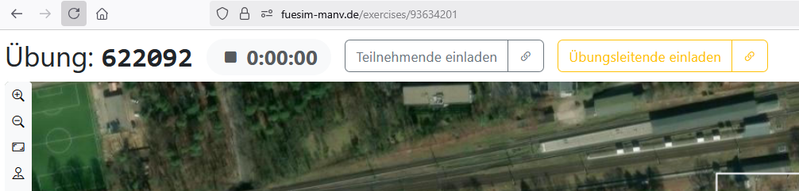
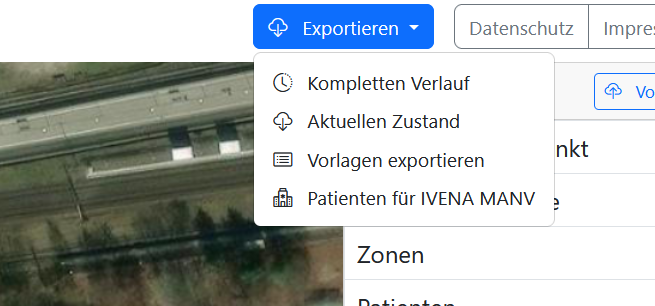
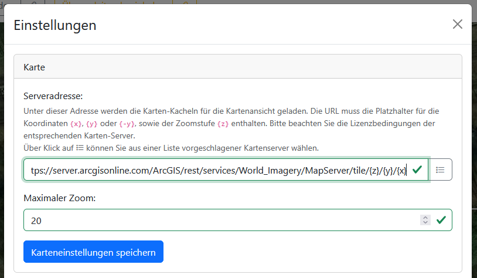
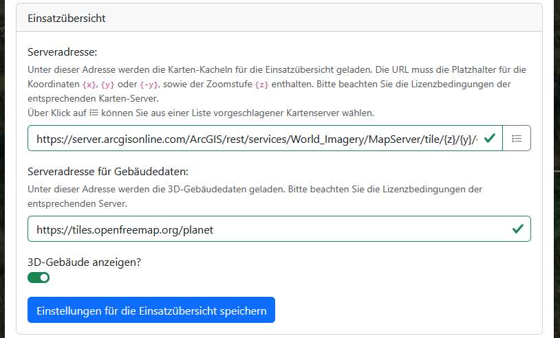
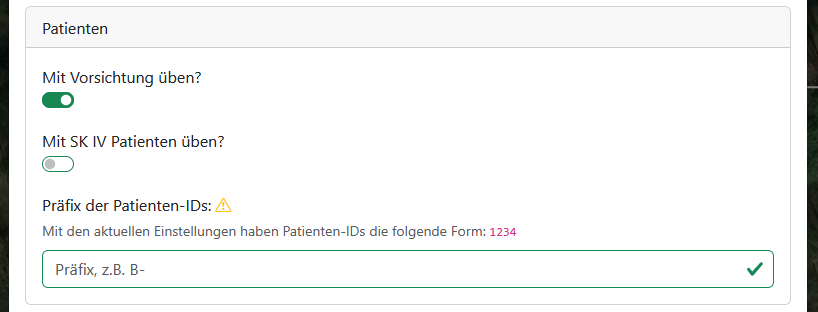
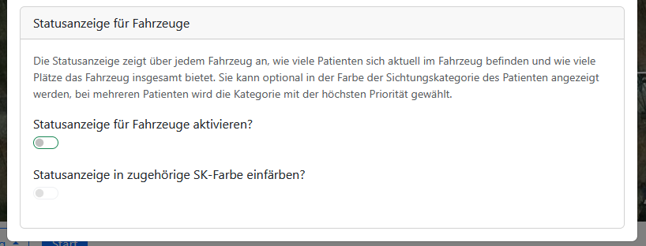

# Allgemeines

## Übungen anlegen

Eine neue Übung kann auf der Startseite durch Klicken auf den Button <kbd>Übung erstellen</kbd> erstellt werden. Dazu sind weder ein Benutzerkonto noch eine anderweitige besondere Berechtigung notwendig. Nach dem erfolgreichen Erstellen werden die Übungsleitungs- und die Teilnehmenden-PIN unterhalb des Buttons angezeigt. Die Übungsleitungs-PIN wird zudem automatisch in das Formularfeld <kbd>Übungs-PIN</kbd> im linken Teil der Seite eingetragen, sodass ein [Beitritt zur neu erstellten Übung](#übungsbeitritt) als Übungsleitung mit nur einem Klick möglich ist.

Für Nutzende mit einem Benutzerkonto ist es zudem möglich, Übungsvorlagen zu erstellen und zu bearbeiten. Aus Vorlagen lassen sich dann durchführbare Übungen erstellen. Näheres dazu in [Übungselemente und -vorlagen](../4_editing/).

## Übungsbeitritt

Um einer Übung über die Startseite beizutreten, muss die entsprechende [Übungs-PIN](#übungs-pins) in das Formularfeld <kbd>Übungs-PIN</kbd> im linken Teil der Seite eingegeben und auf <kbd>Übung beitreten</kbd> geklickt werden.

Nach dem Klick öffnet sich ein Fenster, in dem optional ein Name eingegeben werden. Den Namen sehen in der Übung nur die Übungsleitenden. Mit erneutem Klick auf <kbd>Übung beitreten</kbd> wird der Name bestätigt und man erklärt seine Zustimmung zu den Nutzungsbedingungen und der Datenschutzerklärung.

## Übungs-PINs

Für das Beitreten zu einer Übung gibt es verschiedene Arten von PINs für unterschiedliche Berechtigungen bzw. Teilnahmearten. Ein Beitritt ist sowohl über die Eingabe der PIN [auf der Startseite](#übungsbeitritt) als auch direkt über das Öffnen der [teilbaren Links](2_user_interfaces.md#einladungs-buttons) (Format: `fuesim-manv.de/exercises/<PIN>`) möglich.

### Teilnehmenden-PIN

Die Teilnehmenden-PIN ist sechsstellig und ermöglicht den Beitritt als Teilnehmender. Teilnehmende müssen zur aktiven Mitwirkung in einer Übung durch die Übungsleitung freigegeben werden und können auf eine bestimmte [Ansicht](3_exercise_elements.md#ansichten) eingeschränkt werden.

### Übungsleitungs-PIN

Die Übungsleitungs-PIN ist achtstellig und ermöglicht den Beitritt als Mitglied der Übungsleitung. Mitglieder der Übungsleitung haben alle Berechtigungen innerhalb der Übung und können somit alle übrigen Nutzenden verwalten, einschließlich anderer Übungsleitender. Die Übungsleitungs-PIN wird in der Übung nicht offen angezeigt und sollte vertraulich behandelt werden.

### PINs teilen

Um die jeweiligen PINs einfach an weitere Nutzende weiterzugeben und diese zur Übung hinzuzufügen, gibt es in einer Übung in der oberen Menüleiste die Buttons <kbd>Teilnehmende einladen</kbd> und <kbd>Übungsleitende einladen</kbd>. Näheres dazu unter [Übungsansicht](2_user_interfaces.md#übungsansichtkartenansicht).

## Übungszustände

### Vorbereitung

In einer neu angelegte Übung kann die Übungsleitung zunächst das Szenario vorbereiten. In diesem Zustand bleibt der Timer auf `0:00:00` und ist die Karte für Teilnehmende ausgegraut, sodass sie keine Aktionen durchführen können.

Für die Übungsleitung sind hingegen sämtliche Interaktionen mit Patienten, Fahrzeugen und Personal bereits möglich. Allerdings beginnen die Sichtung und Behandlung bzw. Verschlechterung der Patienten noch nicht, selbst wenn das Rettungspersonal korrekt platziert wird. Auch gestartete Transfers laufen noch nicht. Mit einem Klick auf <kbd>Sofort</kbd> in der [Transferübersicht](4_conduction.md#transfers-verwalten) können Fahrzeuge und Personal allerdings aus dem Transfer herausgenommen und wieder auf der Karte platziert werden.

Übungsleitende können in der Vorbereitung bereits Teilnehmende zu einer Übung hinzufügen und diese in Vorbereitung auf den Übungsstart in bestimmte Ansichten einteilen (siehe [Teilnehmende verwalten](4_conduction.html#teilnehmende-verwalten)).

### Vorlage

Eine Übungsvorlage ist eine Übung in einer speziellen Variante des Vorbereitungs-Zustands. Vorlagen können analog bearbeitet werden.

Übungsvorlagen können allerdings nicht direkt gestartet werden. In der [Vorlagenverwaltung](../4_editing/#übungsvorlagen-verwalten) kann allerdings auf Basis einer Vorlage eine neue Übung erstellt werden, die dann gestartet werden kann.

### Gestartet/Laufend

Eine vorbereitende Übung kann durch einen Übungsleitenden gestartet werden. Ab diesem Zeitpunkt beginnt die Übungszeit, und alle bereits zugeordneten Teilnehmenden können mit der Übung interagieren.

### Pausiert

Ein Übungsleiter kann eine Übung jederzeit pausieren. Im pausierten Modus ist die Karte ausgegraut und Teilnehmende können nicht mit der Übung interagieren. Pausierte Übungen können jederzeit wieder aufgenommen werden.

### Beendet

In der FüSim Digital gibt es kein explizites Übungsende. Eine Übung kann lediglich pausiert werden.

> [!TIP]
> Es wird unbedingt empfohlen, die Übung auch am Ende zu pausieren, damit bei der [Auswertung](5_evaluation.md) nur die relevanten Zeiträume in Statistik und Zeitstrahl betrachtet werden.

### Gelöscht

Ein Übungsleiter kann eine Übung jederzeit löschen. Das Löschen ist dauerhaft und unwiderruflich. Ein automatisches Löschen von Übungen findet aktuell nicht statt; bestehende Übungen bleiben unter ihren PINs dauerhaft aufrufbar.

> [!WARNING]
> Für eines der nächsten Updates ist geplant, dass nicht genutzte Übungen von Nutzenden ohne Konto nach einer gewissen Zeit ohne Verwendung automatisch gelöscht werden. Es wird deshalb empfohlen, relevante Übungsinhalte zu [exportieren](#übungsinhalte-exportieren) oder ein [Benutzerkonto anzulegen](../5_users/#registrierung), in dem die Übung verwaltet wird.

## Übungsinhalte exportieren

Durch Klick auf den Button <kbd>Exportieren</kbd> in der oberen Menüleiste innerhalb einer Übung kann diese ganz oder teilweise exportiert werden. Standardmäßig wird als Export eine [`.json`-Datei](https://de.wikipedia.org/wiki/JSON) mit der Übungs-PIN im Dateinamen zum Download bereitgestellt.

### Übungen exportieren

Die Optionen <kbd>Kompletten Verlauf</kbd> und <kbd>Aktuellen Zustand</kbd> ermöglichen jeweils den Export der jeweiligen Übung, die dann über die Startseite zur [Erstellung einer neuen Übung](#übungen-importieren) importiert werden können. Alternativ kann ein Übungsexport auch als [neue Übungsvorlage in das eigene Benutzerkonto](../4_editing/#übungsvorlagen-verwalten) importiert werden.

Der aktuelle Zustand umfasst dabei nur den Ist-Stand der aktuellen Übung zum Zeitpunkt des Exports. Diese Option ist dann nützlich, wenn die exportierte Übung als Vorlage für spätere Übungen verwendet werden soll.

Der komplette Verlauf enthält dagegen zusätzlich ein vollständiges Protokoll aller bisherigen Aktionen durch Übungsleitende und Teilnehmende. Ein Export des Verlaufs ist dann sinnvoll, wenn eine abgeschlossene Übung für eine spätere [Auswertung](5_evaluation.md) gesichert werden soll.

> [!NOTE]
> Der Verlauf einer Übung umfasst auch ein Protokoll jedes einzelnen (Zwischen-)Schrittes während der Übungserstellung durch die Übungsleitung (z.B. das Platzieren, Verschieben, Löschen, Benennen und Umbenennen von Elementen). Da alle diese Schritte zum Zeitpunkt `0:00:00` passieren, kann dieses Erstellungsprotokoll nicht als [Aufzeichnung](5_evaluation.md#aufzeichnung) in der FüSim Digital abgespielt werden, es kann aber von technisch versierten Personen aus der `.json`-Datei ausgelesen werden.

### ~~Vorlagen exportieren~~

~~Mit der Option "Vorlagen exportieren" ist es möglich, die bereits erstellten Vorlagen für Patienten, Fahrzeuge und Bilder (siehe~~ [Übungselemente](3_exercise_elements.md)~~) zu exportieren, um diese für andere Übungen wiederzuverwenden (siehe~~ [~~Vorlagen importieren~~](#vorlagen-importieren)~~). Es kann ausgewählt werden, welche dieser Vorlagentypen Teil des (partiellen) Exports sein sollen.~~

> [!WARNING]
> Der **partielle Export** von Vorlagen steht aufgrund von Umbauarbeiten für eine neue Version der Software, welche umfangreiche Funktionen zum Verwalten von Vorlagen enthalten wird, **nicht mehr zur Verfügung**. Als Alternative besteht die Möglichkeit, eine [vollen Übungsexport](#übungen-exportieren) durchzuführen und in der `.json`-Datei nicht benötigte Elemente zu löschen. Der Import von alten partiellen Exporten ist weiterhin unter [Vorlagen importieren](#vorlagen-importieren) möglich.

### Patientendaten für IVENA MANV exportieren

Mit der Option <kbd>Patienten für IVENA MANV</kbd> wird eine `.csv`-Datei generiert, die die IDs, Sichtungskategorie und weitere relevante Daten aller in der Übung platzierten Patienten enthält.

Die Datei kann in IVENA MANV importiert werden. Dadurch können beispielsweise Evakuierungs- und Abtransport-Szenarien geübt werden, bei denen die Übungsteilnehmenden einen laufenden Einsatz übernehmen und somit bereits zum Übungsstart vor dem Scannen der Patienten erste Daten in IVENA MANV vorliegen.

## Übungsinhalte importieren

### Übungen importieren

Auf der Startseite gibt es (neben dem Button zum [Anlegen einer neuen Übung](#übungen-anlegen)) die Möglichkeit, eine Übung zu importieren. Wird dort eine passende (d. h. aus der FüSim Digital [exportierte](#übungen-exportieren)) `.json`-Datei hochgeladen, wird eine neue Übung angelegt und mit einer Kopie der Daten aus der Datei gefüllt.

> [!NOTE]
> Die neu angelegte Übung hat nach dem Import komplett neue [Übungs-PINs](#übungs-pins) und keinen Zusammenhang mehr zur alten Übung, deren Daten exportiert wurden, und deren PINs.

### Vorlagen importieren

Um bereits erstellte Patienten, Fahrzeuge und Bilder (siehe [Übungselemente](3_exercise_elements.md)) wiederzuverwenden, gibt es am oberen Rand des [Editors](2_user_interfaces.md#editor-nur-in-übungsleitenden-ansicht)) den Button <kbd>Vorlagen importieren</kbd>.

Nach Klick auf diesen Button muss eine Vorlage `.json`-Datei ausgewählt werden. Bevor der Import erfolgt, muss entschieden werden, ob die bestehenden Patienten-, Fahrzeug- und Bildvorlagen ergänzt oder ob sie gelöscht und vollständig durch die neuen überschrieben werden sollen.

> [!WARNING]
> Wenn die Option <kbd>Ergänzen</kbd> zum Vorlagen-Import ausgewählt wird, werden Patienten-, Fahrzeug- und Bildvorlagen, die in der derzeitigen Übung _und_ in der `.json`-Datei existieren, möglicherweise doppelt angezeigt, auch wenn die Objekte identisch sind. Dadurch kann der Editor unübersichtlich werden.

> [!IMPORTANT]
> Das Überschreiben von Vorlagen ändert nicht die bereits in einer Übung platzierten Inhalte.

## Übungseinstellungen

Übungsleitende können in der [unteren Menüleiste](2_user_interfaces.md#untere-menüleiste-nur-in-übungsleitenden-ansicht) den Punkt <kbd>Einstellungen</kbd> wählen. Es öffnet sich ein Fenster, in dem globale Einstellungen für die aktuelle Übung vorgenommen werden können.

Die meisten Einstellungen werden sofort nach Eingabe übernommen, lediglich die Änderungen der Kartenserver-Adressen müssen noch manuell bestätigt werden.

### Karte

In diesem Bereich kann die Karte für die primäre [Übungsansicht](2_user_interfaces.md#übungsansichtkartenansicht) konfiguriert werden.

Die wichtigste Einstellung ist die <kbd>**Serveradresse**</kbd>, die bestimmt, von welchem Server die Kartendaten geladen werden. Die URL muss die Platzhalter für die Koordinaten `{x}`, `{y}` oder `{-y}`, sowie der Zoomstufe `{z}` enthalten. Die meisten Anbieter von Kartendaten bieten hierzu standardisierte URLs an.

> [!IMPORTANT]
> Bitte beachten Sie die Lizenzbedingungen der entsprechenden Karten-Server.

> [!WARNING]
> Der Anbieter des genutzten Kartenservers erhält zwar keinen Zugriff auf die Übungsinhalte, aber er kann verfolgen, welche Orte Übungsleitende und Teilnehmende betrachten sowie deren IP-Addressen sammeln und auswerten. Letztes ist ein personenbezogenes Datum im Sinne der DSGVO. Es ist daher erforderlich, die Datenschutzbedingungen des jeweiligen Anbieters zu beachten und die Zustimmung der Nutzenden einzuholen (siehe [Nutzungsbedingungen](https://fuesim-manv.de/about/terms)).

Neben der Serveradresse kann unter <kbd>**Maximaler Zoom**</kbd> die höchste Zoomstufe, für die Kartendaten vom Server geholt werden, eingestellt werden. Wird ein zu höher, nicht unterstützter Wert eingegeben, werden von vielen Servern Fehlerbilder statt Kartenmaterial ausgeliefert, was bei starkem Hereinzoomen eine Übung unbenutzbar macht. Es wird daher empfohlen, die für den jeweiligen Kartenserver maximale Zoomstufe zu recherchieren und hier einzugeben.

Die beiden Einstellungen müssen nach einer Änderung durch einen Klick auf <kbd>Karteneinstellungen speichern</kbd> manuell bestätigt werden.

### Einsatzübersicht

In diesem Bereich kann die Karte für die [Einsatzansicht](2_user_interfaces.md#einsatzübersicht-für-teilnehmende) konfiguriert werden.

Die wichtigste Einstellung ist hier wieder die <kbd>**Serveradresse**</kbd>, die analog zur oben näher beschriebenen [Einstellung für die Übungskarte](#karte) funktioniert.

Zusätzlich kann eine <kbd>**Serveradresse für Gebäudedaten**</kbd> angegeben werden. Hierbei ist ein Kartendienst erforderlich, welcher Vektorkarten bereitstellt, welche eine sogenannte Gebäude-Ebene enthalten (`building`).

Zuletzt kann mit der Einstellung <kbd>**3D-Gebäude anzeigen**</kbd> die 3D-Ansicht mit den Gebäudedaten von der oben genannten Serveradresse aktiviert werden.

Diese drei Einstellungen müssen nach einer Änderung durch einen Klick auf <kbd>Karteneinstellungen für die Einsatzübersicht speichern</kbd> manuell bestätigt werden.

### Patienten

In diesem Bereich werden die patientenbezogenen Aspekte der Übung konfiguriert (siehe [Patienten](3_exercise_elements.md#patienten)).

Mit der Einstellung <kbd>**Mit Vorsichtung üben?**</kbd> wird das Vorsichten von Patienten aktiviert oder deaktiviert. Standardmäßig ist die Vorsichtung aktiviert. Wenn die Vorsichtung deaktiviert ist, haben alle Patienten bereits zu Übungsbeginn eine Sichtungsfarbe. Außerdem ist eine manuelle Anpassung der Sichtungskategorie durch Teilnehmende im Patienten-Popup nicht mehr möglich.

Die Einstellung <kbd>**Mit SK IV Patienten üben?**</kbd> regelt, ob die SK IV (blau) verfügbar ist. Wenn sie deaktiviert ist, wird die Sichtungskategorie SK IV (blau) dort, wo sie gesetzt ist, durch SK I (rot) ersetzt.

Im Feld <kbd>**Präfix der Patienten-IDs**</kbd> kann ein Präfix eingegeben werden, das allen Patienten-IDs in der Übung vorangestellt wird. Mit dieser Einstellung lassen sich Patienten-IDs an ein ortsübliches Schema anpassen, z.B. indem das Ortskennzeichen (z.B. `B-`) vorangestellt wird. Die eigentlichen IDs (der Teil hinter dem Präfix) sind eine bei `0001` beginnende Zahl, die mit vier Ziffern dargestellt wird.

> [!WARNING]
> Wenn bereits Patienten platziert sind, ändern sich deren ID durch das Anpassen dieser Einstellung nicht.

### Statusanzeige für Fahrzeuge

In diesem Bereich kann eine optionale Statusanzeige für [Fahrzeuge](3_exercise_elements.md#fahrzeuge-mit-personal-und-material) aktiviert werden.

Sofern aktiviert, zeigt die Statusanzeige über jedem Fahrzeug an, wie viele Patienten sich aktuell im Fahrzeug befinden und wie viele Plätze es insgesamt bietet. Sie kann optional in der Farbe der Sichtungskategorie des Patienten angezeigt werden, bei mehreren Patienten wird die Kategorie mit der höchsten Priorität gewählt.
