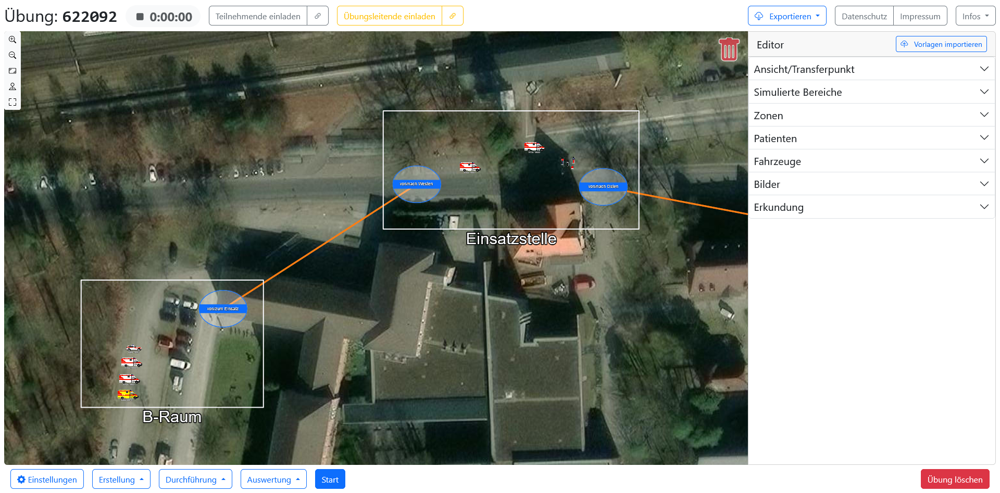
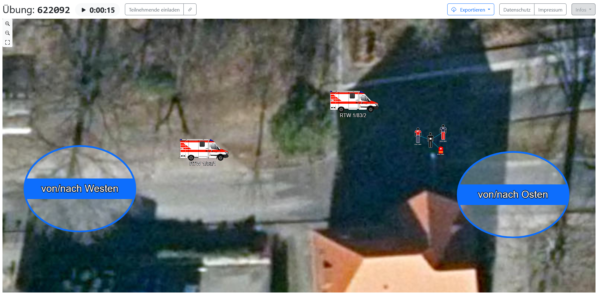
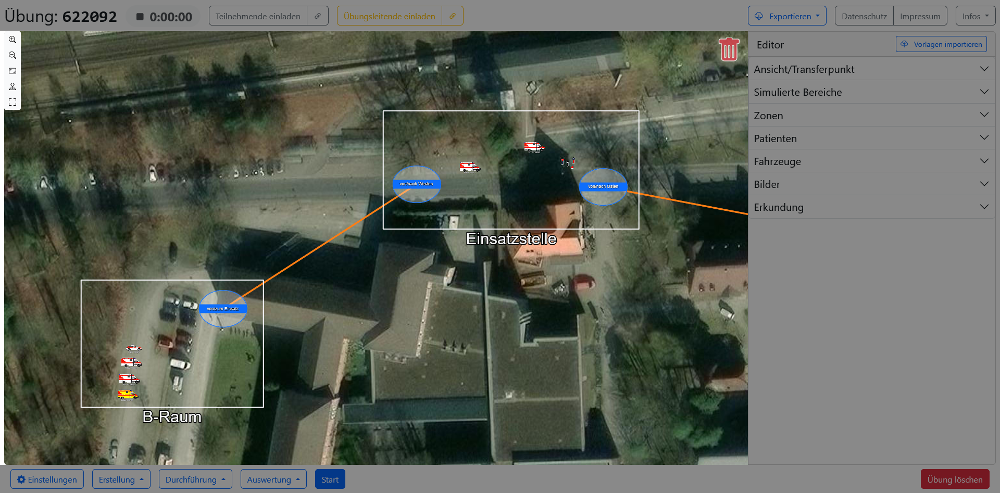
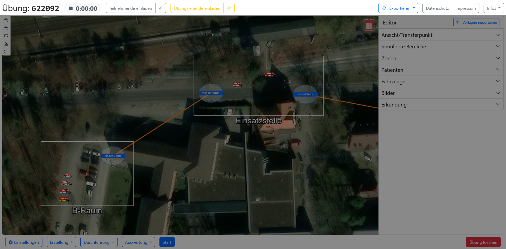
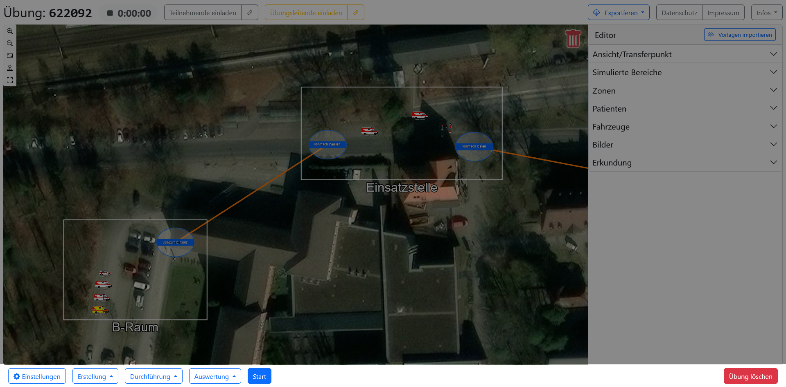
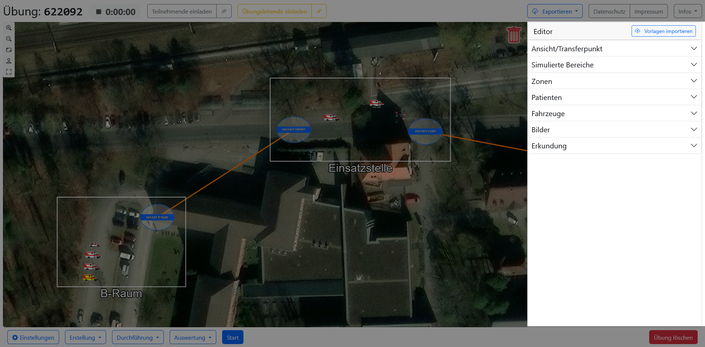
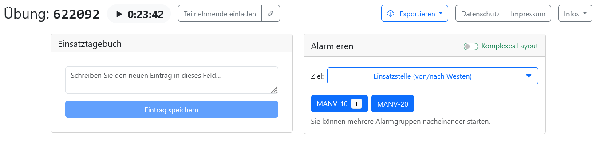
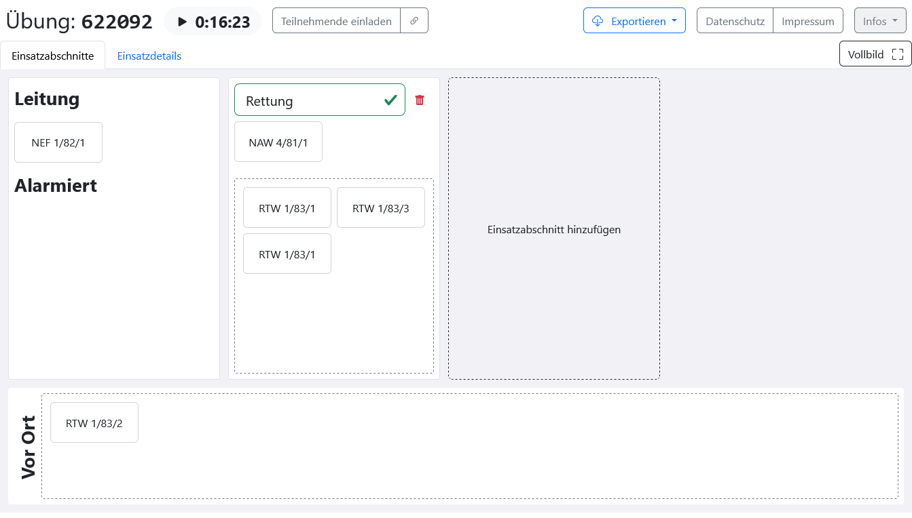
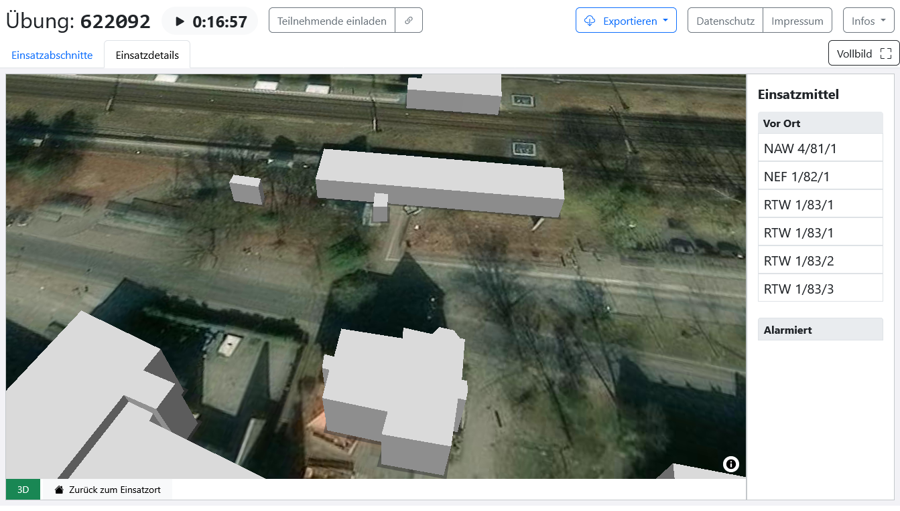

# Benutzeroberflächen

## Startseite

Auf der Startseite der FüSim Digital befinden sich ein Button, um [einer Übung mit einer gegebenen PIN beizutreten](1_general.html#einer-übung-beitreten), und ein Button, um eine [neue Übung zu erstellen](1_general.html#übungen-anlegen).

> [!TIP]
> Angemeldete Benutzer können Übungen und Vorlagen statt über die Startseite über die Benutzeroberflächen für [Übungs- und Vorlagenverwaltung](../4_editing/index.html) neu erstellen bzw. öffnen.

## Übungsansicht/Kartenansicht

### Gesamtübersicht

#### Übungsleitenden-Ansicht

Übungsleitende sehen im Hauptteil die [Karte](#karte), mit einer [Oberen Menüleiste](#obere-menüleiste) (mit Übungsinformationen, Einladungsbuttons, Exportfunktion und allgemeinen Serverinformationen), einer [Unteren Menüleiste](#untere-menüleiste-nur-in-übungsleitenden-ansicht) (mit Hauptmenü und Übungssteuerung) sowie dem [Editor](#editor-nur-in-übungsleitenden-ansicht) an der rechten Seite.

#### Teilnehmenden-Ansicht

Teilnehmende sehen nur die [Karte](#karte) und eine reduzierte [Oberen Menüleiste](#obere-menüleiste).

### Karte

Der Hauptteil der Übungsansicht für Teilnehmende und Übungsleitende ist eine Karte.

Wenn eine Übung pausiert ist, wird die Karte für Teilnehmende ausgegraut und sämtliche Interaktionen, die über Scrollen und Zoomen hinausgehen, werden unterbunden.

Standardmäßig ist eine Satellitenkarte eingestellt. Allerdings kann der Kartenserver in den [Einstellungen](1_general.html#übungseinstellungen) frei gewählt werden, und es sind auch Server ohne Satellitenbild verfügbar.

#### Bewegung und Zoom

Die Karte kann sowohl mit Maus und Tastatur als auch mit Touch-Gesten bedient werden.

Für die Bewegung auf der Karte kann die linke Maustaste an irgendeiner Stelle gedrückt und die Maus bei gedrückter Maustaste bewegt werden. Bei Touch-Geräten wird statt der gedrückten Maustaste ein Fingerdruck verwendet, um den Kartenausschnitt zu verschieben. Wenn eine Tastatur zur Verfügung steht, können zudem die Pfeiltasten genutzt werden.

An einem Gerät mit Maus kann zum Zoomen das Mausrad genutzt werden, wobei beim nach oben Drehen reingezoomt und beim nach unten Drehen rausgezoomt wird. Auf einer Tastatur können die Tasten <kbd>+</kbd> und <kbd>-</kbd> verwendet werden. Bei Touch-Geräten sind zwei Finger für eine Pinch-Geste erforderlich. Wenn die beiden Finger auseinander bewegt werden, entspricht das dem Reinzoomen; wenn die Finger zueinander bewegt werden, entspricht das dem Herauszoomen.

> [!WARNING]
> Bei mehreren Nutzenden, die gleichzeitig mit einem Touch-Geräte (z.B. Smartboard) interagieren, kann es passieren, das unabhängige Interaktionen als starkes Reinzoomen interpretiert wird und die Karte auf einen sehr kleinen Ausschnitt reduziert wird.

#### Buttons

In der oberen linken Ecke der Karte befindet sich eine Gruppe von Buttons zur Bedienung der Karte.

- <kbd>Vergrößern</kbd> (<kbd>+</kbd>): Um eine Stufe hereinzoomen.
- <kbd>Verkleinern</kbd> (<kbd>-</kbd>): Um eine Stufe herauszoomen.
- <kbd>Alle Ansichten anzeigen</kbd>: Wählt die Kartenposition und die Zoomstufe so, dass alle Ansichten zusammen sichtbar sind. Nur für Übungsleitende verfügbar.
- <kbd>Zu Koordinaten springen</kbd>: Öffnet ein Fenster, in dem Koordinaten (Breiten- und Längengrad) eingegeben werden können. Nur für Übungsleitende verfügbar und für die erste Ortsauswahl beim Erstellen einer Übung vorgesehen.
- <kbd>Vollbildmodus</kbd>: Öffnet einen Vollbildmodus, in dem auf dem gesamten Bildschirm nur die Karte (ohne Menüleisten und Editor) sichtbar ist.

### Obere Menüleiste

#### Übungs-Informationen

Im linken Bereich der oberen Menüleiste werden die Teilnehmenden-PIN der Übung sowie die aktuelle Übungszeit angezeigt. Links neben der Übungszeit symbolisiert ein Stopp-Symbol, dass die Übung noch vorbereitet wird, ein Play-Symbol, dass sie läuft, oder ein Pause-Symbol, dass sie pausiert ist.

#### Einladungs-Buttons

In der Mitte der oberen Menüleiste befinden sich Buttons zur Einleitung weiterer Teilnehmender.

Dort ist insbesondere ein grauer Button mit der Beschriftung <kbd>Teilnehmende einladen</kbd> zu sehen. Klickt man auf diesen, wird in einem Popup die Teilnehmenden-PIN noch einmal in groß angezeigt, zusammen mit einem QR-Code, dessen Scannen andere Nutzende direkt zur Übung führt. Übungsleitende sehen an dieser Stelle neben PIN und QR-Code eine Liste aller Teilnehmenden und können diese [einteilen.](4_conduction.html#teilnehmende-verwalten)

Übungsleitende sehen zusätzlich einen zweiten gelben Button mit dem Titel <kbd>Übungsleitende einladen</kbd>. Dieser öffnet ein Popup mit der Übungsleitungs-PIN und einem zugehörigen QR-Code, über den die Übung direkt als Mitglied der Übungsleitung betreten werden kann.

Neben beiden Buttons befindet sich jeweils ein kleiner Ergänzungs-Button mit dem Link-Symbol, mit dem ein Link zur Übung direkt, ohne das Pop-up zu öffnen, in die Zwischenablage kopiert wird.

#### Export und Server-Informationen

Im rechten Bereich der oberen Menüleiste befindet sich ein blauer Button zum Exportieren von ganzen Übungen bzw. einzelnen Übungsinhalten (siehe [Übungsinhalte exportieren](1_general.md#übungsinhalte-exportieren)) sowie weitere Buttons, die zu Datenschutzerklärung, Impressum und Nutzungsbedingungen des jeweiligen Servers führen. Zusätzlich gibt es hier einen Link zum Übermitteln von Feedback.

### Untere Menüleiste (nur in Übungsleitenden-Ansicht)

#### Hauptmenü

Im linken Bereich der unteren Menüleiste befindet sich ein Hauptmenü für Übungsleitungen, das Zugriff auf sämtliche [Konfigurations- und Übersichtsfenster](#konfigurations--und-übersichtsfenster-nur-in-übungsleitenden-ansicht) bietet. Das Menü ist unterteilt in <kbd>Einstellungen</kbd> sowie in die drei Phasen eines typischen Übungs-Lebenszyklus: <kbd>Erstellung</kbd>, <kbd>Durchführung</kbd> und <kbd>Auswertung</kbd>.

#### Übungssteuerung

Rechts neben dem Hauptmenü in der unteren Menüleiste befindet sich ein blauer Button, mit dem die Übung (je nach aktuellem [Zustand](1_general.md#übungszustände)) gestartet, pausiert oder fortgesetzt werden kann (siehe [Übungssteuerung](4_conduction.md#übungssteuerung)).

#### Löschen

Im rechten Bereich der unteren Menüleiste befindet sich ein roter Button, mit dem eine Übung dauerhaft gelöscht werden kann.

### Editor (nur in Übungsleitenden-Ansicht)

Übungsleitende sehen am rechten Rand der Karte den sogenannten Editor. Dieser besteht aus einem Auswahlmenü mit Vorlagen für alle in der Übung platzierbaren [Übungselemente](3_exercise_elements.md). Wenn diese angeklickt und auf die Übungskarte "gezogen" werden, wird basierend auf der Vorlage ein entsprechendes Übungselement entstellt.

#### Platzierbare Übungselemente

Der Editor ist in folgende Kategorien unterteilt:

- **Ansicht/Transferpunkt**: Hier befinden sich Vorlagen für [Ansichten](3_exercise_elements.md#ansichten) (Bereiche einer Übung, denen ein Teilnehmender zugeordnet werden kann) und [Transferpunkte](3_exercise_elements.md#transferpunkte) (verbindbare Punkte, bei denen alarmierte Kräfte eintreffen und zwischen denen Personal und Fahrzeuge transferiert werden können) platziert werden. Optional können hier die (nur für Übungsleitende sichtbaren) Verbindungslinien zwischen Transferpunkten deaktiviert werden.
- **Simulierte Bereiche**: Mithilfe der Vorlagen _Patientenablage_, _Bereitstellungsraum_ oder _Transportorganisation_ können vorkonfigurierte [simulierte Bereiche](../3_simulation/) ausgewählt werden. Als Letztes in der Liste steht die Vorlage für einen generischen simulierten Bereich, der manuell konfiguriert werden kann.
- **Zonen**: Es können [Zonen](3_exercise_elements.md#zonen) platziert werden, wobei es sich um Bereiche auf der Übungskarte handelt, die benannt, farblich markiert sowie auf eine bestimmte Anzahl und bestimmte Arten von Fahrzeugen beschränkt werden können. Die zuerst stehende Vorlage "Eingeschränkte Zone" erzeugt generische und frei konfigurierbare Zonen. Die drei anderen zur Auswahl stehenden Vorlagen sind vorkonfiguriert als mögliche "Ladezone", "Pufferzone" und "RTH-Landeplatz", können aber weiter verfeinert werden.
- **Patienten:** Hier befinden sich Vorlagen für [Patienten](3_exercise_elements.md#patienten), sortiert nach initialer Sichtungskategorie und gekennzeichnet mit dem zu erwartenden Verlauf. Eine Zahl bei jeder Vorlage zeigt, wie viele Ausprägungen für diesen medizinischen Verlauf hinterlegt sind, wobei die Ausprägungen sich durch verschiedene Texte zu den medizinischen Details unterscheiden. Beim Platzieren auf der Karte wird eine der Ausprägungen für den gewählten Verlauf zufällig ausgesucht sowie Name und Stammdaten des Patienten zufällig generiert.
- **Fahrzeuge**: Hier kann aus den Vorlagen für [Fahrzeuge](3_exercise_elements.md#fahrzeuge-mit-personal-und-material) ausgewählt werden, wobei auch neue Vorlagen erstellt und Vorlagen bearbeitet und gelöscht werden können. Es ist zu beachten, dass Änderungen einer Vorlage sich nicht auf bereits platzierte Fahrzeuge auswirken.
- **Bilder**: Bei den [Bildern](3_exercise_elements.md#bilder) handelt es sich um frei platzierbare, dekorative Übungselemente. In diesem Teil des Editors befindet sich eine Liste aller Bild-Vorlagen, wobei auch neue Vorlagen erstellt und Vorlagen bearbeitet und gelöscht werden können. Sämtliche Bilder können nach dem Platzieren noch beliebig modifiziert werden.

#### Import von Übungselementen

In der Überschrift vom Editor befindet sich ein Button zum [Import von Vorlagen](1_general.md#vorlagen-importieren), wobei eine `.json`-Datei mit Patienten-, Fahrzeug- oder Bildvorlagen gewählt werden kann.

### Konfigurations- und Übersichtsfenster (nur in Übungsleitenden-Ansicht)

Folgende Fenster sind über das Hauptmenü in der [unteren Menüleiste](#untere-menüleiste-nur-in-übungsleitenden-ansicht) für Übungsleitende verfügbar:

- **Einstellungen**: Hier können die allgemeinen [Übungseinstellungen](1_general.md#übungseinstellungen) vorgenommen werden.
- **Erstellung**
    - **Alarmierungsgruppen**: In diesem Fenster können [Alarmierungsgruppen](3_exercise_elements.md#alarmierungsgruppen) erstellt, bearbeitet und wieder gelöscht werden.
    - **Krankenhäuser**: In diesem Fenster können [Krankenhäuser](3_exercise_elements.md#krankenhäuser) erstellt, bearbeitet und wieder gelöscht werden.
- **Durchführung**
    - **Teilnehmende**: Fenster zur [Verwaltung der Übungsteilnehmenden](4_conduction.md#teilnehmende-verwalten).
    - **Transferübersicht**: Fenster zur [Verwaltung von laufenden Transfers](4_conduction.md#transfers-verwalten) zwischen Transferpunkten
    - **Leitstelle**: Fenster mit allen [Leitstellenfunktionen](4_conduction.md#alarmierungen), über das Übungsleitende Nachalarmierungen starten und ein Einsatztagebuch führen können.
    - **Simulationseinstellungen (Übungsleitung)**: Einstellungen zur [Simulation](../3_simulation/) von Übungsbestandteilen.
    - **Simulationsübersicht (Funker)**: Schließt die Übungsansicht und öffnet stattdessen die Ansicht für [Schnittstellenfunker](../3_simulation/) zur Kommunikation zwischen Teilnehmenden und simulierten Bereichen.
- **Auswertung**
    - **Statistik**: Fenster mit den [Statistiken](5_evaluation.md#statistiken) zur aktuellen Übung. Beinhaltet auch ein detailliertes Protokoll.
    - **Aufzeichnung**: Schließt die Übungsansicht und öffnet stattdessen die Replay-Ansicht, in der die [Aufzeichnung](5_evaluation.md#aufzeichnung) der aktuellen Übung betrachtet werden kann.

## Leitstellenansicht (für Teilnehmende)

Teilnehmende, die von den Übungsleitenden der Rolle <kbd>Leitstelle</kbd> zugeordnet wurden, sehen diese Oberfläche.

### Einsatztagebuch

In der linken Hälfte des Fensters befindet sich das [Einsatztagebuch](4_conduction.md#einsatztagebuch). Bei kleinen Bildschirmen (z.B. einem Tablet hochkant) befindet es sich unten statt links. Hier können Einträge verfasst und mit Knopfdruck im Tagebuch gespeichert werden. Wenn mehrere Teilnehmende in der Leitstellenansicht sind, können sie gegenseitig ihre Einträge sehen.

### Alarmierungen

In der rechten Hälfte des Fensters befindet sich das Menü zur [Alarmierung](4_conduction.md#alarmierungen) weiterer Einsatzkräfte. Bei kleinen Bildschirmen (z.B. einem Tablet hochkant) befindet es sich oben statt rechts.

In dem Menü muss zunächst ein [Transferpunkt](3_exercise_elements.md#transferpunkte) als Ziel ausgewählt werden und dann eine Alarmgruppe angeklickt werden. Optional kann eine komplexe Ansicht aktiviert werden, bei der ein Teil der alarmierten Fahrzeuge zu einem abweichenden [Transferpunkt](3_exercise_elements.md#transferpunkte) geschickt werden kann.

## Einsatzübersicht (für Teilnehmende)

Teilnehmende können der Rolle <kbd>Einsatzübersicht</kbd> zugeordnet werden und sehen dann eine Benutzeroberfläche, die einer typischen Einsatzapp auf Tablets (z. B. der [FireApp](https://www.fireapp.io/)) nachempfunden ist. Sie bietet zwei Ansichten in separaten Tabs.

### Einsatzabschnitte

In diesem Tab können die vor Ort befindlichen Fahrzeuge in mehrere logische Einsatzabschnitte eingeteilt werden. Diese Einteilung ist unabhängig von der Position am Einsatzort und wird nicht automatisch aktualisiert. Ein Fahrzeug kann dabei auch als Gesamteinsatzleitung markiert werden. Das bietet den Teilnehmenden die Möglichkeit, einen Überblick über die verfügbaren Kräfte zu erhalten und sie unabhängig von der Ansicht und den laufenden Transfers zu gruppieren. Auch alarmierte und sich noch auf Anfahrt befindliche Fahrzeuge werden angezeigt.

### Einsatzdetails

In diesem Tag sehen Übungsteilnehmende, neben einer Liste der alarmierten und eingetroffenen Fahrzeuge, eine Karte des Einsatzortes. Die Karte ist initial auf die platzierten [Ansichten](3_exercise_elements.md#ansichten) zentriert, es kann auf ihr beliebig gezoomt und navigiert werden. Mit dem Button <kbd>Zurück zum Einsatzort</kbd> am unteren Rand der Karte kann die Karte zudem neu zentriert werden.

Mit dem Button <kbd>3D</kbd> in der unteren linken Ecke der Karte kann zudem eine 3D-Ansicht mit den Silhouetten der Gebäude am Einsatzort aktiviert oder deaktiviert werden.

Die 3D-Ansicht kann zudem global in den [Übungseinstellungen](1_general.md#übungseinstellungen) aktiviert oder deaktiviert werden.
