# Übungselemente

Mit Übungselementen sind all jene Objekte gemeint, die im Laufe einer Übung durch die Teilnehmenden direkt oder indirekt verwaltet oder betrachtet werden. Ein Großteil ist auf der Übungskarte zu sehen.

## Ansichten

Bei Ansichten handelt es sich um Bereiche einer Übung, die mit einem weißen REchteck markiert sind.

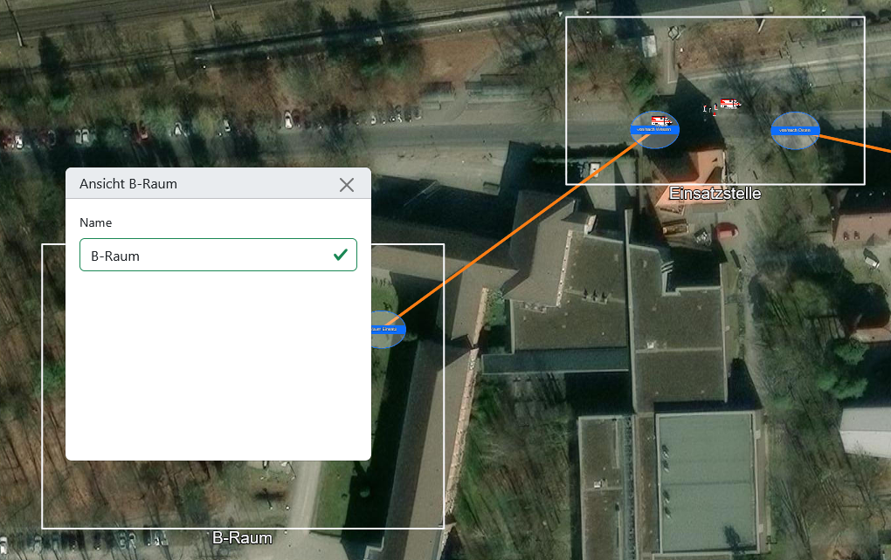

### Interaktion auf der Übungskarte

Sie können über den Editor platziert werden.

Wenn auf den Rand oder die Beschriftung einer Ansicht geklickt wird, können Übungsleitende eine Ansicht mit gedrückter Maustaste verschieben. Wird eine Ecke angeklickt, kann analog die Größe der Ansicht geändert werden. Dieselben Modifikationen sind auch mit Touch-Gesten möglich.

### Einstellungsmöglichkeiten

Im Einstellungs-Popup kann einer Ansicht ein Name zugewiesen werden.

### Nutzung in Übungen

Bei Übungen werden Ansichten üblicherweise genutzt, um Abschnitte darzustellen, in denen ein Teilnehmender als Führungskraft die Verantwortung übernehmen soll.

Bei der [Verwaltung der Übungsteilnehmenden](4_conduction.md#teilnehmende-verwalten) kann den Teilnehmenden jeweils eine Ansicht zugewiesen werden, über deren Grenzen sie dann während der Übung nicht hinaus scrollen oder zoomen können. Auch in den [Statistiken](5_evaluation.md#statistiken) lassen sich die Patienten-, Fahrzeug- und Personalzahlen nach Ansicht filtern.

> [!TIP]
> Für Übungsleitende wird die Karte standardmäßig auf die platzierten Ansichten zentriert. Wenn Übungselemente außerhalb der von Teilnehmenden bespielten Ansichten platziert werden, kann es sich für Übungsleitende daher lohnen, zusätzliche Ansichten um diese Elemente oder um die relevante Übungsfläche als ganzes zu ziehen.

> [!TIP]
> Wenn eine Übung einen größeren Einsatz mit einer mehrstufigen Hierarchie abgebildet wird, sollten auch für die Zwischenebenen Ansichten angelegt werden, um z. B. die Patienten und anwesenden Einsatzkräfte auf allen Ebenen statistisch auszuwerten.

## Transferpunkte

Transferpunkte sind ovale Punkte auf der Karte, die mit einem blauen Rahmen und einem blauen Mittelstreifen gekennzeichnet sind. Sie markieren für Übungsteilnehmende die Eintreff- und Abfahrtspunkte von [Einsatzkräften](#fahrzeuge-mit-personal-und-material).

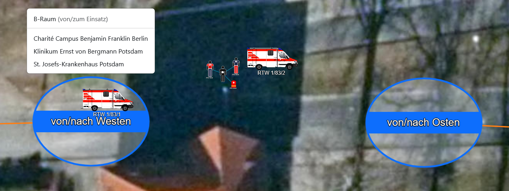

### Interaktion auf der Übungskarte

Transferpunkte können im Editor platziert und anschließend von Übungsleitenden per Drag-and-Drop flexibel auf der Karte verschoben werden.

In der Übungsleitungsansicht werden standardmäßig Verbindungslinien zwischen verbundenen Transferpunkten angezeigt (siehe Einstellungsmöglichkeiten). Diese sind für Teilnehmende nicht sichtbar. Sie können im Editor aktiviert oder deaktiviert werden.

Teilnehmende interagieren mit Transferpunkten, indem sie einzelne [Fahrzeuge oder Personal](#fahrzeuge-mit-personal-und-material) auf die Punkte ziehen und anschließend aus einer Auswahlliste das designierte Transferziel auswählen.

### Einstellungsmöglichkeiten

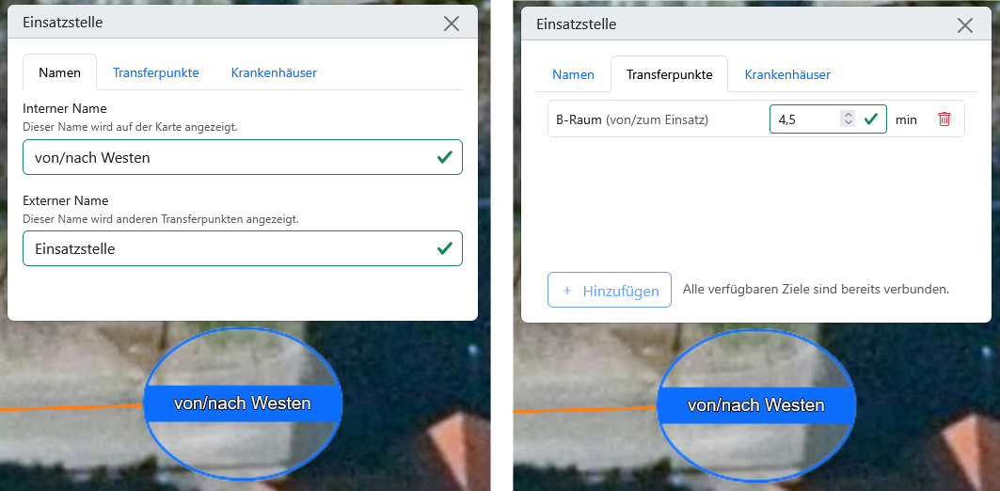

Im Einstellungs-Popup kann im Tab <kbd>Namen</kbd> für jeden Transferpunkt ein interner und ein externer Name festgelegt werden. Der interne Name wird auf der Karte angezeigt und darf daher nur 16 Zeichen lang sein. Der externe Name wird bei anderen Transferpunkten angezeigt, wenn Einsatzkräfte dorthin geschickt werden. Im Tab <kbd>Transferpunkte</kbd> des Einstellungs-Popups kann angegeben werden, zu welchen anderen Transferpunkten eine Verbindung besteht und wie viele Minuten der Transfer dauert. Die Zeitangabe wirkt in beide Richtungen. Im Tab <kbd>Krankenhäuser</kbd> können verbundene Krankenhäuser ausgewählt werden.

> [!TIP]
> Der interne Name sollte so gewählt werden, dass es der Funktion für Übungsteilnehmende entspricht. z. B. „Neue Kräfte“ (wenn dort alarmiertes Personal ankommt), „von/nach Süden“ (wenn darüber Transferpunkte in der entsprechenden Richtung angebunden sind) oder „Krankenhäuser“ (wenn darüber Krankenhäuser angebunden sind).
> Der externe Name sollte dem Standort des Transferpunktes entsprechen, also z. B. dem Namen der Ansicht, in der sich der Transferpunkt befinden (z. B. „Abschnitt Nord“).

### Nutzung in Übungen

Transferpunkte können als Eintreffpunkte für Kräfte dienen, die über die [Leitstelle](4_conduction.md#alarmierungen) alarmiert wurden. Wenn Transferpunkte untereinander verbunden sind, können über sie Kräfte zwischen verschiedenen Orten in der Übung verschoben werden, was eine gewisse Zeit in Anspruch nimmt (siehe [Transferübersicht](4_conduction.md#transfers-verwalten)). Dazu müssen Teilnehmende oder Übungsleitende ein Fahrzeug oder Personal auf den Ausgangs-Transferpunkt verschieben; es taucht dann entsprechend verzögert am anderen Transferpunkt wieder auf. Zuletzt können Fahrzeuge von Transferpunkten zu einem verbundenen Krankenhaus geschickt werden.

## Zonen

Bei Zonen handelt es sich um Bereiche auf der Übungskarte, die benannt, farblich markiert sowie auf eine bestimmte Anzahl und bestimmte Arten von Fahrzeugen beschränkt sein können.

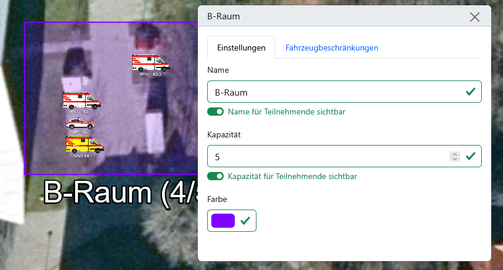

Eine Zone wird aus einer Vorlage im Editor heraus erstellt, wobei neben einer _Eingeschränkten Zone_ ohne besondere Eigenschaften bereits Vorlagen für _Ladezone_, _Pufferzone_ und _RTH-Landeplatz_ bereitstehen.

### Interaktion auf der Übungskarte

Analog zu den Ansichten kann mit einem anhaltenden Klick (oder einer Berührung auf einem Touch-Gerät) auf die Fläche, den Rand oder die Beschriftung eine Zone verschoben werden. Wird die Ecke angeklickt oder berührt, kann die Größe geändert werden.

### Einstellungsmöglichkeiten

Im Einstellungs-Popup der Zone kann im Tab <kbd>Einstellungen</kbd> der Name, die Kapazität und die Farbe der Zone eingestellt werden. Bei der Kapazität handelt es sich um die Anzahl der Fahrzeuge, die sich in der Zone aufhalten. Für den Namen und die Kapazität der Zone kann zudem jeweils eingestellt werden, ob sie für Teilnehmende sichtbar sind. Im Tab <kbd>Fahrzeugbeschränkungen</kbd> kann für jede Fahrzeugvorlage eingestellt werden, ob Fahrzeuge dieser Art unbeschränkt erlaubt sind (grün), unter die Kapazitätsgrenze fallen (gelb) oder pauschal verboten sind (rot).

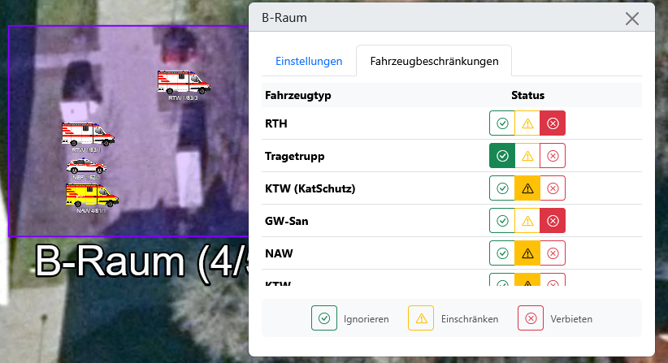

### Nutzung in Übungen

Sofern es entsprechend eingestellt ist, wird zu einer Zone den Teilnehmenden die aktuelle Anzahl und Kapazität der enthaltenen Fahrzeuge angezeigt. Das kann den Teilnehmenden helfen, den Überblick zu behalten.

Zusätzlich wird die Kapazitätsbeschränkung durchgehend überprüft. Wenn Fahrzeuge, die verboten oder über der erlaubten Kapazität sind, in einen Bereich verschoben werden sollen, schlägt das fehl und das Fahrzeug wird an den Ausgangspunkt zurückgeschoben.

> [!WARNING]
> Die Beschränkungen der Zone gelten nur für das Verschieben von Fahrzeugen auf der Karte. Das heißt, wenn sich ein Transferpunkt auf einer Zone befindet und ein Fahrzeug an dem Transferpunkt ankommt, welches eigentlich nicht erlaubt ist oder die Kapazität überschreitet, erscheint es trotzdem in der Zone.

## Fahrzeuge (mit Personal und Material)

Fahrzeuge sind die wichtigste taktische Einheit, die in der FüSim Digital von den Teilnehmenden verwaltet wird. Fahrzeuge beinhalten Personal und Materialien. Fahrzeuge können auf der Karte platziert, aber vor allem auch über [Alarmgruppen](#alarmgruppen) in den Einsatz geschickt werden.

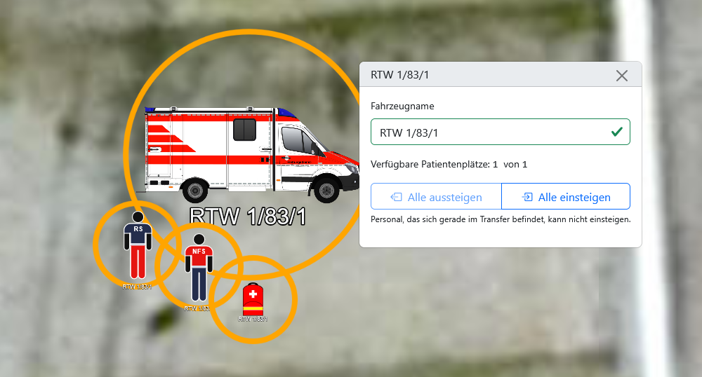

### Interaktion auf der Übungskarte

Übungsleitende können Fahrzeuge direkt aus dem Editor heraus auf der Karte platzieren.

Fahrzeuge und ausgestiegenes Personal können von Teilnehmenden und Übungsleitenden flexibel auf der gesamten Karte per Drag-and-Drop hin- und hergeschoben werden.

Mit einem Klick auf das Fahrzeug öffnet sich ein Popup, in dem das Personal und die Patienten im Fahrzeug aufgelistet werden. Teilnehmende haben einen Button <kbd>Alle aussteigen</kbd>, mit dem Personal, Material und Patienten das Fahrzeug verlassen. Für Übungsleitende gibt es einen zusätzlichen Button <kbd>Alle einsteigen</kbd>, um das Personal und Material mit einem Klick wieder "an Bord" zu holen.

Das ausgestiegene Personal und Material können auf der Karte gleichermaßen per Drag-and-Drop bewegt werden. Wenn es in der Nähe von [Patienten](#patienten) platziert wird, erscheint eine Verbindungslinie, um die Behandlungszuordnung darzustellen. Mit einem Klick auf das Personal oder Material sehen Teilnehmende zudem in einem Pop-up die möglichen Behandlungskapazitäten.

> [!WARNING]
> Es gibt keine automatischen Kontrollmechanismen für die Bewegung von Fahrzeugen, Personal und Material in der Übung. Das heißt, sofern keine [Zone](#zonen) eingerichtet wurde, können sie auch auf Bereiche der Karte bewegt werden, die in der realen Welt unerreichbar wären (z. B. auf Hausdächer). Gleichermaßen können Fahrzeuge zudem auch dann bewegt werden, wenn kein Personal als Kraftfahrer an Bord ist.

### Einstellungsmöglichkeiten

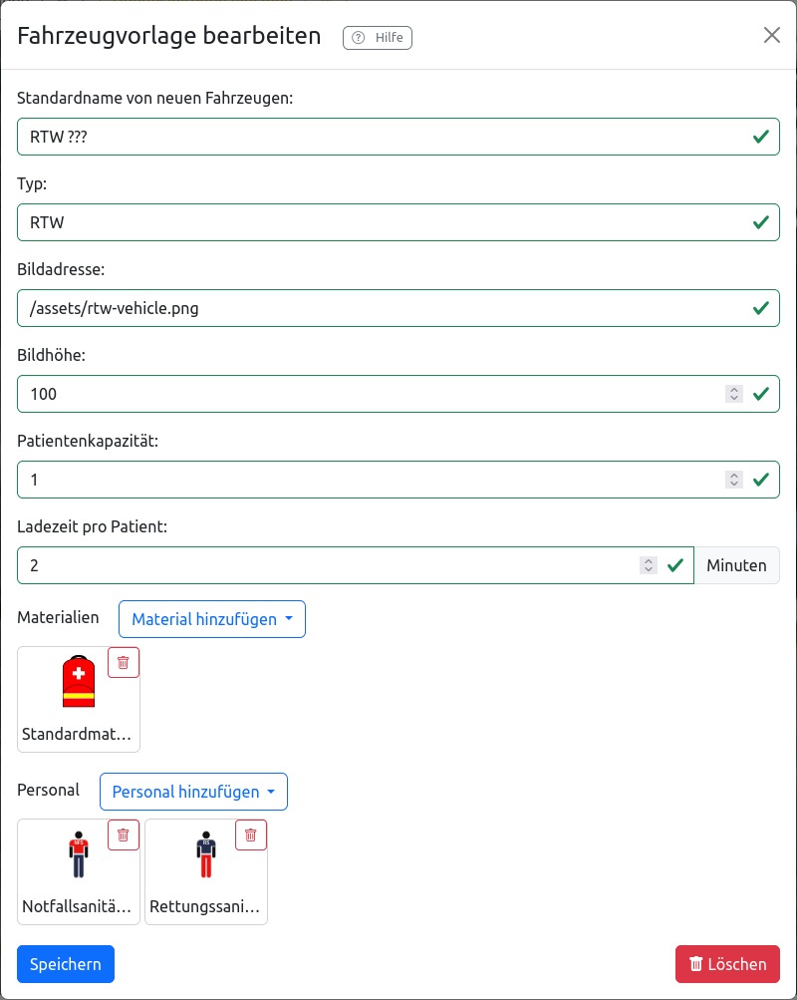

Übungsleitende können im Editor Fahrzeugvorlagen neu erstellen und bestehende Vorlagen bearbeiten. Im entsprechenden Bearbeitungsfenster kann Folgendes angegeben werden:

- <kbd>**Standardname**</kbd>: Individueller Name, mit dem neu platzierte Fahrzeuge initial versehen werden, typischerweise mit „??“ anstelle einer Funkkennung.
- <kbd>**Typ**</kbd>: Bezeichnung des Fahrzeugtyps ohne Platzhalter für die genaue Kennung; wird im Editor angezeigt und für die Sortierung der Fahrzeuge in der Statistik verwendet.
- <kbd>**Bildadresse**</kbd>: URL zu einer Bilddatei. Das Bild sollte idealerweise eine Vektorgrafik (`.svg`) mit transparentem Hintergrund sein.
- <kbd>**Bildhöhe**</kbd>: Höhe des Bildes in Punkten, wobei 100 ca. der Höhe eines normalen Sprinter-RTWs entspricht. Die Breite wird analog skaliert.
- <kbd>**Patientenkapazität**</kbd>: Anzahl der Patienten, die im Fahrzeug transportiert werden können. Kann 0 sein für Fahrzeuge, die keine Patienten transportieren können (z.B. Führungsfahrzeuge).
- <kbd>**Materialien**</kbd>: Hier können Materialien hinzugefügt oder entfernt werden. Standardmäßig steht _Standardmaterial_ (entspricht einem Rettungsdienst-Rucksack) und _erweitertes Material_ (entspricht einer Gruppe GW-San-Kisten und ermöglicht die Behandlung vieler Patienten) zur Verfügung.
- <kbd>**Personal**</kbd>: Hier kann Personal hinzugefügt oder entfernt werden. Standardmäßig stehen die medizinischen Qualifikationsstufen _Sanitäter_ (ehrenamtliche Sanitätshelfer ohne rettungsdienstliche Qualifikation), _Rettungssanitäter_, _Notfallsanitäter_, _Notarzt_ und _Gruppenführer_ (hat keine Behandlungskapazität) zur Verfügung.

Am unteren Rand des Bearbeitungsfensters befindet sich ein Button zum <kbd>Hinzufügen</kbd>, bzw. im Falle der Bearbeitung einer existierenden Vorlage zum <kbd>Speichern</kbd> oder <kbd>Löschen</kbd>.

Nach dem Platzieren auf der Karte können Übungsleitende nur den Namen des Fahrzeugs noch anpassen; alle anderen Einstellungen sind wie oben genannt auf Ebene der Vorlage zu treffen.

> [!WARNING]
> Änderungen an Fahrzeugvorlagen wirken nur für die Zukunft. Fahrzeuge, die zum Zeitpunkt der Änderung bereits auf der Karte platziert wurden, bleiben unverändert.

### Nutzung in Übungen

Fahrzeuge sind die wichtigste taktische Einheit in der FüSim Digital.

Fahrzeuge, die manuell auf der Karte platziert sind, stellen Kräfte dar, die bei Übungsbeginn (entspricht der Übernahme der Führung durch die Teilnehmenden) bereits vor Ort sind. Dabei handelt es sich typischerweise um ersteintreffende Einsatzmittel, die verstreut und noch ohne zentrale Taktik arbeiten.

Da FüSim Digital Übungen meistens die Frühphase eines Einsatzes umfassen, wo das Nachalarmieren von Einsatzkräften ein wichtiges Lernziel ist, werden die meisten Fahrzeuge in [Alarmgruppen](#alarmgruppen) hinterlegt und über diese durch die Leitstelle in den Einsatz geschickt.

## Patienten

Die Behandlung von Patienten ist die zentrale Herausforderung in einer MANV-Lage. Entsprechend sind Patienten, die sich dynamisch verändern, ein Kernelement der FüSim Digital.

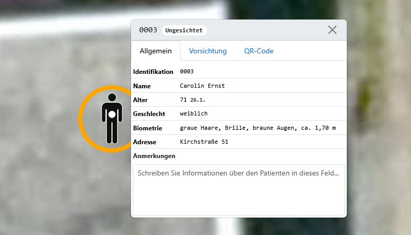

### Interaktion auf der Übungskarte

Übungsleitende können Patienten aus dem Editor heraus auf der Karte platzieren. Sowohl Übungsleitende als auch Teilnehmende können Patienten per Drag-and-Drop auf der Karte verschieben.

Das Patientensymbol auf der Karte zeigt, ob ein Patient gehfähig ist (stehendes Icon) oder nicht (liegendes Icon). Zusätzlich zeigt ein Punkt in der Mitte die aktuelle Sichtungsfarbe an. Wenn [Personal und Material](#fahrzeuge-mit-personal-und-material) neben einen Patienten geschoben werden, erscheinen Verbindungslinien, die anzeigen, welches medizinische Personal welchen Patienten aktuell behandelt.

Teilnehmende sehen, wenn sie Patienten anklicken, ein Pop-up mit der Patienten-ID und dem Sichtungsstatus in der Überschrift sowie vier Tabs für den Inhalt. Im Tab <kbd>Allgemein</kbd> sind die Stammdaten (ID, Name, Alter, Geschlecht, Anschrift, Biometrie) sowie ein Feld für Anmerkungen zu finden, das durch die Teilnehmenden ausgefüllt werden kann. Im Tab <kbd>Vorsichtung</kbd> sind medizinische Informationen sowie ein Auswahlmenü zu finden, in dem eine Sichtungskategorie ausgewählt und Patienten als Transportpriorität markiert werden können. Im Tab <kbd>QR-Code</kbd> ist ein QR-Code zu sehen, der standardmäßig die Patienten-ID repräsentiert. Der als QR-Code angezeigte Text kann manuell überschrieben werden. Im Tab <kbd>Erkundung</kbd> können Übungsleitende zusätzliche Informationen hinterlegen, die Teilnehmende dann während der Übung aufrufen können. Die Patienten erhalten dann ein zusätzliches Sprechblasen-Symbol, welches das Vorhandensein von Erkundungsinformationen kennzeichnet.

Übungsleitende sehen ein identisches Popup, wobei im Tab <kbd>Allgemein</kbd> zusätzlich als <kbd>Beschreibung</kbd> der zu erwartende medizinische Verlauf mit einigen Icons angezeigt wird (quasi die Musterlösung, siehe [Einstellungsmöglichkeiten](#einstellungsmoglichkeiten-4)).

### Einstellungsmöglichkeiten

> [!IMPORTANT]
> Patienten können in der FüSim Digital derzeit nicht bearbeitet werden.

Die Patienten sind in der FüSim nach medizinischem Verlauf sortiert, wobei der Verlauf immer durch eine Folge von drei Icons gekennzeichnet wird:

- <svg xmlns="http://www.w3.org/2000/svg" width="16" height="16" fill="currentColor" class="bi bi-arrow-right-square-fill" viewBox="0 0 16 16" style="color: rgb(220, 53, 69);"><path d="M0 14a2 2 0 0 0 2 2h12a2 2 0 0 0 2-2V2a2 2 0 0 0-2-2H2a2 2 0 0 0-2 2zm4.5-6.5h5.793L8.146 5.354a.5.5 0 1 1 .708-.708l3 3a.5.5 0 0 1 0 .708l-3 3a.5.5 0 0 1-.708-.708L10.293 8.5H4.5a.5.5 0 0 1 0-1"/></svg>/<svg xmlns="http://www.w3.org/2000/svg" width="16" height="16" fill="currentColor" class="bi bi-arrow-right-square-fill" viewBox="0 0 16 16" style="color: rgb(255, 193, 7);"><path d="M0 14a2 2 0 0 0 2 2h12a2 2 0 0 0 2-2V2a2 2 0 0 0-2-2H2a2 2 0 0 0-2 2zm4.5-6.5h5.793L8.146 5.354a.5.5 0 1 1 .708-.708l3 3a.5.5 0 0 1 0 .708l-3 3a.5.5 0 0 1-.708-.708L10.293 8.5H4.5a.5.5 0 0 1 0-1"/></svg>/<svg xmlns="http://www.w3.org/2000/svg" width="16" height="16" fill="currentColor" class="bi bi-arrow-right-square-fill" viewBox="0 0 16 16" style="color: rgb(25, 135, 84);"><path d="M0 14a2 2 0 0 0 2 2h12a2 2 0 0 0 2-2V2a2 2 0 0 0-2-2H2a2 2 0 0 0-2 2zm4.5-6.5h5.793L8.146 5.354a.5.5 0 1 1 .708-.708l3 3a.5.5 0 0 1 0 .708l-3 3a.5.5 0 0 1-.708-.708L10.293 8.5H4.5a.5.5 0 0 1 0-1"/></svg> = stabil
- <svg xmlns="http://www.w3.org/2000/svg" width="16" height="16" fill="currentColor" class="bi bi-exclamation-triangle-fill" viewBox="0 0 16 16" style="color: rgb(220, 53, 69);"><path d="M8.982 1.566a1.13 1.13 0 0 0-1.96 0L.165 13.233c-.457.778.091 1.767.98 1.767h13.713c.889 0 1.438-.99.98-1.767zM8 5c.535 0 .954.462.9.995l-.35 3.507a.552.552 0 0 1-1.1 0L7.1 5.995A.905.905 0 0 1 8 5m.002 6a1 1 0 1 1 0 2 1 1 0 0 1 0-2"/></svg>/<svg xmlns="http://www.w3.org/2000/svg" width="16" height="16" fill="currentColor" class="bi bi-exclamation-triangle-fill" viewBox="0 0 16 16" style="color: rgb(255, 193, 7);"><path d="M8.982 1.566a1.13 1.13 0 0 0-1.96 0L.165 13.233c-.457.778.091 1.767.98 1.767h13.713c.889 0 1.438-.99.98-1.767zM8 5c.535 0 .954.462.9.995l-.35 3.507a.552.552 0 0 1-1.1 0L7.1 5.995A.905.905 0 0 1 8 5m.002 6a1 1 0 1 1 0 2 1 1 0 0 1 0-2"/></svg>/<svg xmlns="http://www.w3.org/2000/svg" width="16" height="16" fill="currentColor" class="bi bi-exclamation-triangle-fill" viewBox="0 0 16 16" style="color: rgb(25, 135, 84);"><path d="M8.982 1.566a1.13 1.13 0 0 0-1.96 0L.165 13.233c-.457.778.091 1.767.98 1.767h13.713c.889 0 1.438-.99.98-1.767zM8 5c.535 0 .954.462.9.995l-.35 3.507a.552.552 0 0 1-1.1 0L7.1 5.995A.905.905 0 0 1 8 5m.002 6a1 1 0 1 1 0 2 1 1 0 0 1 0-2"/></svg> = Komplikation
- <svg xmlns="http://www.w3.org/2000/svg" width="16" height="16" fill="currentColor" class="bi bi-heartbreak-fill" viewBox="0 0 16 16" style="color: rgb(220, 53, 69);"><path d="M8.931.586 7 3l1.5 4-2 3L8 15C22.534 5.396 13.757-2.21 8.931.586M7.358.77 5.5 3 7 7l-1.5 3 1.815 4.537C-6.533 4.96 2.685-2.467 7.358.77"/></svg>/<svg xmlns="http://www.w3.org/2000/svg" width="16" height="16" fill="currentColor" class="bi bi-heartbreak-fill" viewBox="0 0 16 16" style="color: rgb(255, 193, 7);"><path d="M8.931.586 7 3l1.5 4-2 3L8 15C22.534 5.396 13.757-2.21 8.931.586M7.358.77 5.5 3 7 7l-1.5 3 1.815 4.537C-6.533 4.96 2.685-2.467 7.358.77"/></svg> = lebensrettende Maßnahme erforderlich
- <svg xmlns="http://www.w3.org/2000/svg" width="16" height="16" fill="currentColor" class="bi bi-signpost-fill" viewBox="0 0 16 16" style="color: rgb(220, 53, 69);"><path d="M7.293.707A1 1 0 0 0 7 1.414V4H2a1 1 0 0 0-1 1v4a1 1 0 0 0 1 1h5v6h2v-6h3.532a1 1 0 0 0 .768-.36l1.933-2.32a.5.5 0 0 0 0-.64L13.3 4.36a1 1 0 0 0-.768-.36H9V1.414A1 1 0 0 0 7.293.707"/></svg> = Transportpriorität
- <svg xmlns="http://www.w3.org/2000/svg" width="16" height="16" fill="currentColor" class="bi bi-x-circle-fill" viewBox="0 0 16 16" style="color: rgb(33, 37, 41);"><path d="M16 8A8 8 0 1 1 0 8a8 8 0 0 1 16 0M5.354 4.646a.5.5 0 1 0-.708.708L7.293 8l-2.647 2.646a.5.5 0 0 0 .708.708L8 8.707l2.646 2.647a.5.5 0 0 0 .708-.708L8.707 8l2.647-2.646a.5.5 0 0 0-.708-.708L8 7.293z"/></svg> = verstorben

Im Editor sind die Patienten nach der initialen Sichtungskategorie sortiert; darunter sind Vorlagen nach ihrem medizinischen Verlauf aufgelistet. Eine Zahl bei jeder Vorlage zeigt, wie viele Ausprägungen für diesen medizinischen Verlauf hinterlegt sind, wobei die Ausprägungen sich durch verschiedene Texte zu den medizinischen Details (im Tab <kbd>Vorsichtung</kbd>) unterscheiden. Beim Platzieren auf der Karte wird eine der Ausprägungen des gewählten Verlaufs zufällig ausgewählt. Gleichermaßen werden alle Stammdaten zufällig generiert.

### Nutzung in Übungen

Patienten sollten von Übungsleitenden bei der Erstellung und vor dem Übungsstart in die Übung platziert werden.

Patienten können während der laufenden Übung auch von Teilnehmenden verschoben werden. Analog zu einem realen Einsatz kann dadurch z. B. das schnelle „Sammeln“ der gehfähigen Patienten am Rand der Einsatzstelle geübt werden. Auch liegende Patienten können frei bewegt werden, was z. B. dem Aufbau einer strukturierten Patientenablage oder dem Vorbereiten auf den Abtransport entsprechen könnte. Je nach Lernziel müssen die Übungsleitenden darauf achten, dass liegende Patienten im Sinne des Übungsrealismus nicht zu frühzeitig verschoben werden, damit die Teilnehmenden eine realistischere Herausforderung bei der Raumordnung haben.

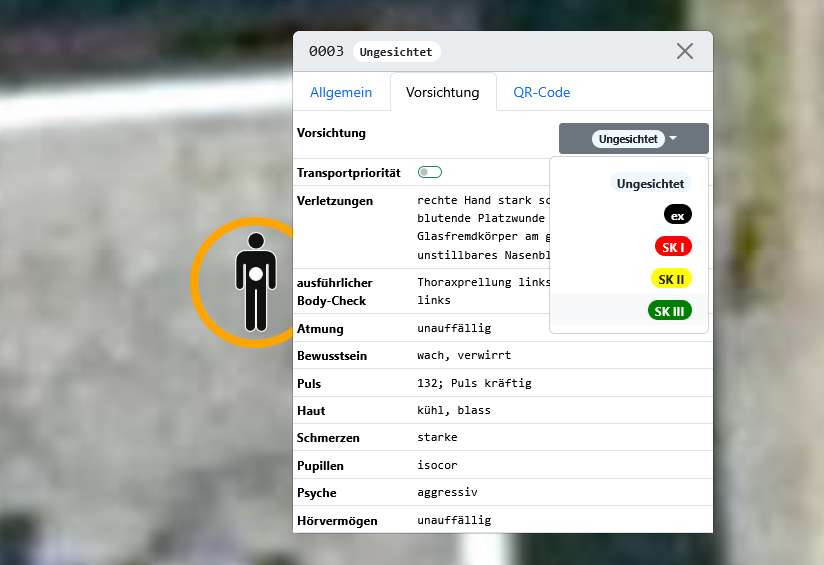

Die medizinischen Details und das manuelle Auswählen einer Sichtungsfarbe durch Teilnehmende im Tab <kbd>Vorsichtung</kbd> ermöglichen, dass Teilnehmende die Besatzung eines ersteintreffenden Rettungsmittels spielen und entsprechend die Vorsicht übernehmen müssen. Sobald weitere Kräfte eintreffen, sollten die Teilnehmenden allerdings die Rolle einer Führungskraft einnehmen und die unterstellten Einsatzkräfte vorsichten lassen. Dazu muss, wie bei der medizinischen Behandlung, das entsprechende Personal neben die Patienten geschoben werden, bis eine Verbindungslinie erscheint. Pro Patient wird eine Minute zur Vorsichtung benötigt.

## Bilder

Bei den Bildern handelt es sich um frei platzierbare, dekorative Übungselemente.

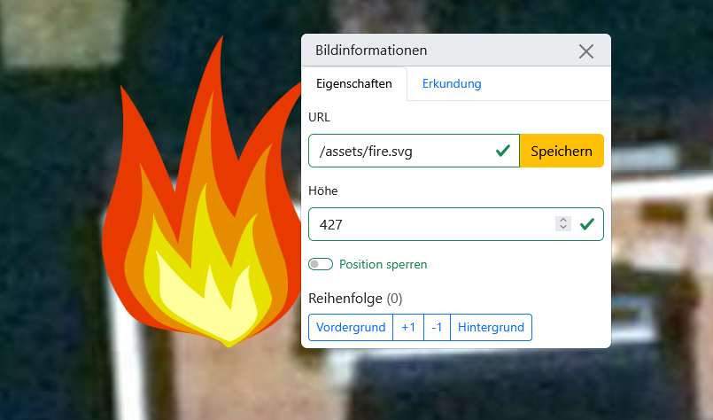

### Interaktion auf der Übungskarte

Teilnehmende sehen Bilder auf der Übungskarte, können aber nicht mit ihnen interagieren.

Übungsleitende können Bilder aus dem Editor heraus platzieren und per Drag-and-Drop auf der Karte verschieben.

Alle anderen Übungselemente werden über den Bildern angezeigt.

### Einstellungsmöglichkeiten

Im Editor befindet sich eine Liste aller Bild-Vorlagen. Dort besteht die Möglichkeit, neue Vorlagen hinzuzufügen und bestehende zu bearbeiten und zu löschen.

Dabei können folgende Eigenschaften gesetzt werden:

- <kbd>**Bildadresse**</kbd>: URL zu einer Bilddatei. Das Bild sollte idealerweise eine Vektorgrafik (`.svg`) mit transparentem Hintergrund sein.
- <kbd>**Name**</kbd>: Bezeichnung des Bildes, die in der Liste im Editor angezeigt wird.
- <kbd>**Höhe**</kbd>: Höhe des Bildes in Punkten, wobei 100 ca. der Höhe eines normalen Sprinter-RTWs entspricht. Die Breite wird analog skaliert.

Nach dem Platzieren können im Einstellungsfenster die <kbd>Bildadresse</kbd> sowie die <kbd>Höhe</kbd> weiterhin geändert werden. Zusätzlich kann Folgendes für platzierte Bilder eingestellt werden:

- <kbd>**Position sperren**</kbd>: Wenn diese Option aktiviert ist, können Übungsleiter das Bild nicht mehr versehentlich verschieben. Das ist nützlich, z.B. wenn Bilder als Hintergrund für die Übungsfläche genutzt werden.
- <kbd>**Reihenfolge**</kbd>: Legt fest, in welcher Ebene sich überlappende Bilder angezeigt werden. Ein Bild mit einer höheren Zahl überdeckt ggf. eines mit einer niedrigeren. Die Buttons <kbd>Vordergrund</kbd> und <kbd>Hintergrund</kbd> geben einem Bild automatisch eine Ebene, die größer oder kleiner als die aller anderen Bilder ist.

Zudem lassen sich im Tab <kbd>Erkundung</kbd> zusätzliche Informationen hinterlegen, die Teilnehmende dann während der Übung aufrufen können. Die Bilder erhalten dann ein zusätzliches Lupen-Symbol, welches das Vorhandensein von Erkundungsinformationen kennzeichnet.

### Nutzung in Übungen

Bilder sind hauptsächlich als dekoratives Element vorgesehen. Beispielsweise können Fahrzeugsilhouetten Verkehr und beengte Arbeitsmöglichkeiten auf Straßen darstellen und Bilder von Feuer oder Trümmerteilen entsprechende Einsatzursachen visuell andeuten.

Es ist auch möglich, ein großes Bild als Hintergrund für eine Übung zu verwenden, z. B. wenn ein Einsatz im Innenraum geübt wird.

## Krankenhäuser

Krankenhäuser können in der FüSim Digital als mögliche Transportziele für den Abtransport von [Patienten](#patienten) hinterlegt werden.

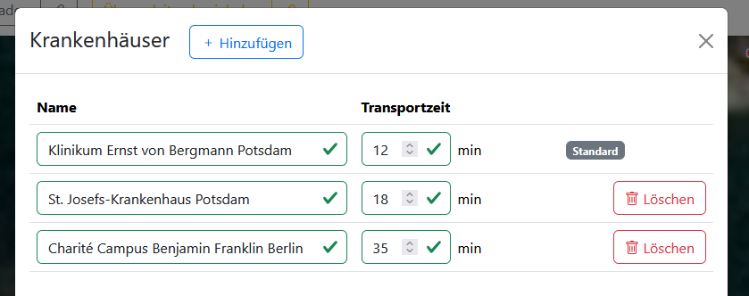

### Einstellungsmöglichkeiten

Krankenhäuser werden im Fenster <kbd>Krankenhäuser</kbd> erstellt, das von Übungsleitenden im [Hauptmenü in der unteren Menüleiste](2_user_interfaces.md#konfigurations--und-übersichtsfenster-nur-in-übungsleitenden-ansicht) in der Kategorie <kbd>Erstellung</kbd> aufgerufen werden kann.

In dem Fenster können in einer Liste Krankenhäuser mit Namen und einer Transportzeit angelegt werden. Alle Namen und Zeiten können nachträglich angepasst werden; neu erstellte Krankenhäuser können wieder gelöscht werden.

> [!IMPORTANT]
> Da für bestimmte Aspekte der [simulierten Bereiche](../3_simulation/) mindestens ein Krankenhaus erforderlich ist, kann das erste Krankenhaus in der Liste nicht gelöscht werden.

### Nutzung in Übungen

Wenn es für das Übungsziel dienlich ist, kann eine große Anzahl von Krankenhäusern angelegt werden. Im [Statistik](5_evaluation.md#statistiken)-Fenster wird dann die Transferzeit genutzt, um die Ankunftszeiten im jeweiligen Krankenhaus auszuwerten.

In einer Übung können Krankenhäuser als Ziel bei einem [Transferpunkt](#transferpunkte) hinterlegt werden.

> [!TIP]
> Zu einem Krankenhaus geschickte Fahrzeuge sind permanent aus der Übung entfernt. Es wird daher empfohlen, nicht denselben Transferpunkt für Transfers an der Einsatzstelle und zu Krankenhäusern zu nutzen.

Übende können einen Patiententransport in ein Krankenhaus auslösen, indem sie ein Fahrzeug mit einem eingeladenen Patienten per Drag-and-Drop auf einen entsprechend verknüpften Transferpunkt ziehen und anschließend den Transport beauftragen.

> [!WARNING]
> Auch Fahrzeuge _ohne_ Patient können ins Krankenhaus geschickt werden und sind dann nicht mehr verfügbar. Es sollte darauf geachtet werden, das das nicht ausversehen passiert.

## Alarmgruppen

Über Alarmgruppen werden in Übungen [Einsatzmittel (Fahrzeuge)](#fahrzeuge-mit-personal-und-material) in strukturiertem Rahmen dem Einsatzort zugeführt.

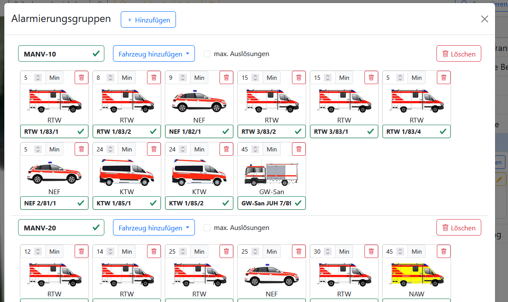

### Einstellungsmöglichkeiten

Alarmgruppen werden im Fenster <kbd>Alarmgruppen</kbd> erstellt, das von Übungsleitenden im [Hauptmenü in der unteren Menüleiste](2_user_interfaces.md#konfigurations--und-übersichtsfenster-nur-in-übungsleitenden-ansicht) in der Kategorie <kbd>Erstellung</kbd> aufgerufen werden kann.

In dem Fenster können neue Alarmgruppen hinzugefügt sowie wieder gelöscht werden. Jeder Gruppe kann ein individueller Name zugewiesen werden (standardmäßig „???“). Mit einem Klick auf das entsprechende Häkchen kann zudem ein Limit für die maximale Anzahl an Auslösungen festgelegt werden, wodurch sich versehentliche Doppelarmierungen vermeiden lassen.

Jede Alarmgruppe kann mit Fahrzeugen gefüllt werden; für jedes Fahrzeug können ein individueller Name sowie eine Eintreffzeit (in Minuten) festgelegt werden. Fahrzeuge können mit einem Klick wieder aus der Gruppe entfernt werden.

### Nutzung in Übungen

Alarmgruppen entsprechen mehr oder weniger spezifisch einer Alarm- und Ausrückeordnung, die die Teilnehmenden nachalarmieren sollten. Es ist auch möglich, das gestaffelte Eintreffen der initial alarmierten Kräfte über eine Alarmgruppe abbilden, die die Übungsleitenden bereits bei der Vorbereitung auslösen, sodass sich die Fahrzeuge beim Übungsstart im Transfer befinden.

Typische Alarmgruppen für generische MANV-Übungen sind beispielsweise MANV-10, MANV-20, MANV-30 etc., wobei bei jeder Erhöhung der MANV-Stufe alle weiteren Alarmgruppen bis zur aktuell gemeldeten Patientenzahl ausgelöst werden.

Alternativ ist es möglich, mit Alarmgruppen sehr konkret die Stichwörter der örtlichen Alarm- und Ausrückeordnung nachzubilden. Dabei ist zu beachten, dass, je kleinteiliger die Stichwörter sind, desto stärker die Eintreffzeiten an den jeweiligen Einsatzort angepasst werden müssen. Eine Wiederverwendung an einem anderen Ort im selben Leitstellengebiet ist somit ohne Mehraufwand nicht möglich.

In beiden hier beschriebenen Anwendungen sollten die Alarmgruppen auf eine Auslösung begrenzt werden. Das gilt insbesondere für die [von Teilnehmenden verwaltete Leitstelle](2_user_interfaces.md#leitstellenansicht-für-teilnehmende). Wenn die örtliche Alarm- und Ausrückeordnung mehrfach alarmierbare Module umfasst, sollten jeweils mehrere Alarmgruppen für „xxx (erster Alarm)“, „xxx (zweiter Alarm)“ etc. angelegt werden, um den zunehmend langen Anfahrtswegen Rechnung zu tragen.

Alarmgruppen ohne Auslösungsbeschränkung oder mit einer hohen Anzahl möglicher Auslösungen sind beispielsweise für Szenarien sinnvoll, in denen mit Alarmgruppen das Nachfordern von Kräften aus einem voll besetzten Bereitstellungsraum abgebildet wird.
