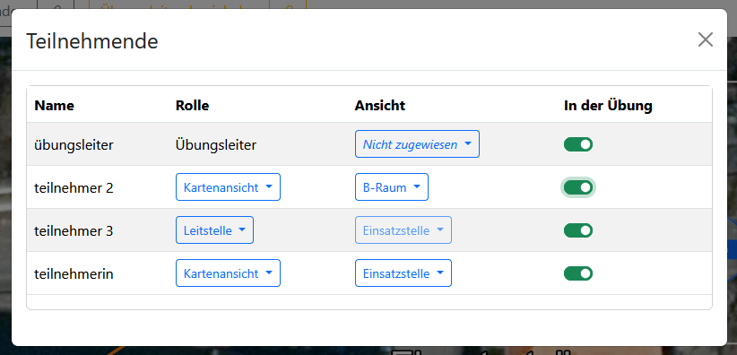
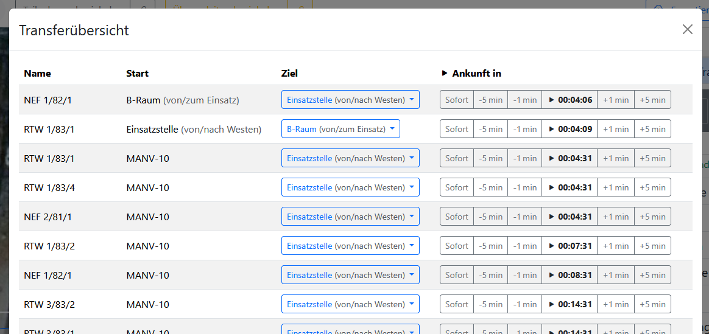
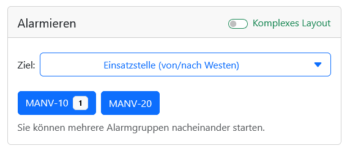
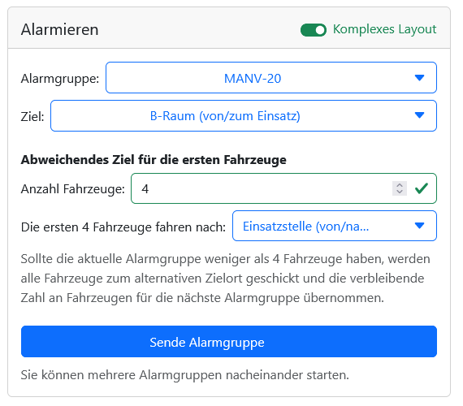
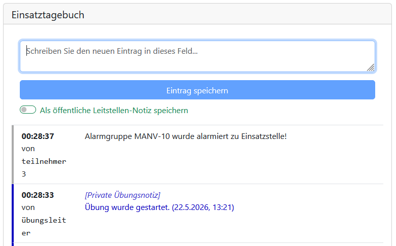

# Durchführung

Während einer Übung können alle Teilnehmenden mit den jeweils für sie sichtbaren [Übungselementen](3_exercise_elements.md) interagieren.

Übungsleitende haben zusätzlich verschiedene Steuerungs- und Eingriffs-Möglichkeiten, die hier zusammengefasst sind. Die zugehörigen Fenster können größtenteils über das [Hauptmenü](2_user_interfaces.md#hauptmenü) unter <kbd>Durchführung</kbd> aufgerufen werden.

## Übungssteuerung

> [!NOTE]
> Die Buttons für Zustandsänderungen finden Übungsleitenden in der [unteren Menüleiste](2_user_interfaces.md#untere-menüleiste-nur-in-übungsleitenden-ansicht) rechts neben dem Hauptmenü.

Übungsleitende können den [Zustand einer Übung](1_general.md#übungszustände) jederzeit ändern.

### Starten

Zum Start der Übung muss ein Übungsleiter auf den Button <kbd>Start</kbd> klicken und den Übungsbeginn bestätigen. Ab diesem Zeitpunkt beginnt die Übungszeit, und alle bereits zugeordneten Teilnehmenden können mit der Übung interagieren.

### Pausieren

Ein Übungsleiter kann eine laufende Übung jederzeit über den Button <kbd>Pause</kbd> anhalten. Ab diesem Zeitpunkt werden für Teilnehmende die Karte ausgegraut und sämtliche Interaktionen blockiert. Pausierte Übungen können mit einem Klick auf <kbd>Start</kbd> fortgesetzt werden.

### Beenden

In der FüSim Digital gibt es kein explizites Übungsende. Eine Übung kann lediglich pausiert werden.

Es ist demzufolge Aufgabe der Übungsleitung, das Ende der Übung gegenüber den Teilnehmenden auf geeignete Weise zu kommunizieren.

> [!WARNING]
> Es wird unbedingt empfohlen, die Übung auch am Ende zu pausieren, damit bei der [Auswertung](5_evaluation.md) nur die relevanten Zeiträume in Statistik und Zeitstrahl betrachtet werden.

### Löschen

Ein Übungsleiter kann eine Übung jederzeit über den entsprechenden Button löschen. Das Löschen ist dauerhaft und unwiderruflich. Sämtliche mit einer Übung verbundenen Teilnehmenden werden beim Löschen ohne Vorwarnung getrennt.

## Teilnehmende verwalten

> [!NOTE]
> Die Teilnehmendenübersicht kann von Übungsleitenden im [Hauptmenü](2_user_interfaces.md#hauptmenü) über <kbd>Durchführung</kbd> → <kbd>Teilnehmende</kbd> geöffnet werden. Sie wird außerdem für Übungsleitende im [<kbd>Teilnehmende einladen</kbd>-Popup](2_user_interfaces.md#einladungs-buttons) angezeigt.

Die Teilnehmendenübersicht zeigt die aktuell an der Übung beteiligten Personen. Das beinhaltet sowohl die eigentlichen (Übungs-)Teilnehmenden als auch die Übungsleitenden.

> [!WARNING]
> Auch wenn von Teilnehmenden gesprochen wird, zeigt die Übersicht die in der Übung angemeldeten Geräte. Zwar benutzt meisten eine Person ein Gerät, aber es ist auch möglich, dass mehrere Teilnehmende dasselbe Gerät benutzen (z.B. ein Smartboard) oder das ein Übender mehrere Geräte bedient.

Während Übungsleitende fest zugeordnet sind, können Teilnehmenden in der Spalte <kbd>Rolle</kbd> eine Rolle (<kbd>Kartenansicht</kbd>, <kbd>Leitstelle</kbd>, <kbd>Einsatzansicht</kbd>) zugewiesen werden. Zudem kann Teilnehmenden mit der Rolle <kbd>Kartenansicht</kbd> sowie Übungsleitenden eine konkrete Ansicht zugeordnet werden.

> [!WARNING]
> Übungsleitende haben, auch wenn sie einer Ansicht zugeordnet sind, alle Konfigurationsoptionen und können sich jederzeit selbst aus der Ansicht entfernen. Die entsprechende Funktion ist daher vor allem zum Testen einer Ansicht gedacht und nicht zur Durchsetzung einer räumlichen Begrenzung im Übungsverlauf.

Jeder Teilnehmer muss nach der Anmeldung einzeln freigeschaltet werden, um an der Übung teilnehmen zu können. Das betrifft auch Teilnehmende, die sich, z. B. nach einem Verbindungsabbruch, erneut mit der Übung verbinden.

## Transfers verwalten

> [!NOTE]
> Die Transferübersicht kann von Übungsleitenden im [Hauptmenü](2_user_interfaces.md#hauptmenü) über <kbd>Durchführung</kbd> → <kbd>Transferübersicht</kbd> geöffnet werden.

Fahrzeuge und Personal, die Teil einer Übung sind, können zu einem [Transferpunkt](3_exercise_elements.md#transferpunkte) transferiert werden. Ein Transfer kann von einem anderen Transferpunkt oder einer [Alarmierungsgruppe](3_exercise_elements.md#alarmierungsgruppen) ausgehen.

Fahrzeuge und Personal in diesem Zustand sind auf der Karte _nicht_ sichtbar. Stattdessen läuft für sie ein versteckter Countdown bis zur Ankunft am Zieltransferpunkt. Übungsleitende haben in einem Übersichtsfenster die Möglichkeit, alle laufenden Transfers einzusehen und anzupassen.

Im Fenster <kbd>Transferübersicht</kbd> wird in einer Tabelle die Liste aller Fahrzeuge und des Personals angezeigt, die sich aktuell im Transfer befinden. Die Einträge sind nach der Reihenfolge der Transferstarts sortiert. Nach einer Spalte für den Namen des Fahrzeuges oder Personals und einer für den Startpunkt ([Transferpunkt](3_exercise_elements.md#transferpunkte) oder [Alarmierungsgruppe](3_exercise_elements.md#alarmierungsgruppen)) wird in einer weiteren Spalte der Zieltransferpunkt angezeigt. Durch Klick auf den aktuellen Zieltransferpunkt öffnet sich eine Auswahl, in der ein beliebiger anderer Transferpunkt als Ziel ausgewählt werden kann.

In der letzten Spalte wird mittig ein Countdown für die Zeit bis zur Ankunft am Zieltransferpunkt angezeigt. Durch einen Klick auf diesen Countdown-Timer wird der Transfer pausiert oder wieder gestartet. Mit den links und rechts angrenzenden Buttons <kbd>-5 min</kbd>, <kbd>-1 min</kbd>, <kbd>+1 min</kbd> und <kbd>+5 min</kbd> kann die Eintreffzeit in 1- bzw. 5-Minuten-Schritten angepasst werden.

Sobald der Countdown `0:00:00` erreicht (und solange nicht der Transfer oder die gesamte Übung pausiert ist), erscheint das Fahrzeug bzw. das Personal am Zieltransferpunkt auf der Karte und verschwindet aus der Transferübersicht.

Durch Klick auf <kbd>Sofort</kbd> kann zudem der Transfer sofort beendet und das Fahrzeug bzw. das Personal am Zieltransferpunkt platziert werden (funktioniert auch in noch nicht gestarteten oder pausierten Übungen).

## Alarmierungen

> [!NOTE]
> Alarmierungen können von Übungsleitenden im Fenster <kbd>Leitstelle</kbd> (was im [Hauptmenü](2_user_interfaces.md#hauptmenü) über <kbd>Durchführung</kbd> → <kbd>Leitstelle</kbd> aufgerufen wird) getätigt werden, sowie von Übenden, die der [Leitstellenansicht](2_user_interfaces.md#leitstellenansicht-für-teilnehmende) zugeordnet sind.

Der Bereich <kbd>Alarmierungen</kbd> kann auf zwei Arten betrachtet werden, zwischen denen mit dem Schalter <kbd>Komplexes Layout</kbd> oben rechts neben der Überschrift umgeschaltet werden kann.

### Normales Layout

Im vereinfachten Layout gibt es ein Dropdown-Menü <kbd>Ziel auswählen</kbd>, mit dem ein Transferpunkt ausgewählt werden kann. In Szenarien mit vielen [Transferpunkten](3_exercise_elements.md#transferpunkte) kann über eine Textsuche nach dem gewünschten Punkt gesucht werden.

Unterhalb der Zielauswahl befinden sich Buttons für alle in der Übung verfügbaren [Alarmierungsgruppen](3_exercise_elements.md#alarmierungsgruppen). Bei Alarmierungsgruppen mit begrenzter Anzahl an Auslösungen wird die Anzahl der verbleibenden Auslösungen hinter dem Namen der Alarmgruppe angezeigt. Unabhängig von eventuellen Begrenzungen wird bei jeder Gruppe, die bereits mindestens einmal alarmiert wurde, der Hinweis <kbd>bereits alarmiert</kbd> hinter ihrem Namen angezeigt. Wenn kein Ziel gewählt ist oder eine Auslösung aufgrund der Begrenzung nicht mehr möglich ist, wird der jeweilige Button ausgegraut.

Mit einem Klick auf den jeweiligen Button wird die entsprechende Alarmgruppe ausgelöst, was bedeutet, dass die jeweiligen [Fahrzeuge](3_exercise_elements.md#fahrzeuge-mit-personal-und-material) mit den hinterlegten Zeiten in den Transfer zum ausgewählten Transferpunkt gehen.

### Komplexes Layout

Im komplexen Layout wird zunächst die [Alarmierungsgruppe](3_exercise_elements.md#alarmierungsgruppen) über ein Dropdown-Menü ausgewählt und anschließend im zweiten Dropdown-Menü der [Zieltransferpunkt](3_exercise_elements.md#transferpunkte).

Zusätzlich kann unter der Überschrift <kbd>Abweichendes Ziel für die ersten Fahrzeuge</kbd> eine Anzahl von Fahrzeugen ausgewählt werden, die an einem abweichenden Transferpunkt eintreffen. Sobald ein Wert größer oder gleich 1 eingegeben wurde, muss auch ein zusätzlicher [Zieltransferpunkt](3_exercise_elements.md#transferpunkte) im entsprechenden Dropdown-Menü ausgewählt werden. An dieses Ziel werden dann die ersten X Fahrzeuge der Alarmgruppe geschickt.

Wenn die Alarmgruppe und die notwendigen ein oder zwei Zieltransferpunkte ausgewählt wurden, kann der Button <kbd>Sende Alarmgruppe</kbd> angeklickt werden, um die Alarmgruppe auszulösen und die entsprechenden Fahrzeuge in den Transfer zu schicken. Die entsprechenden Fahrzeuge werden dann sofort mit den gespeicherten Zeiten in den Transfer gegeben. Der Senden-Button kann mehrfach hintereinander gedrückt werden. Wenn eine erneute Auslösung der Alarmgruppe aufgrund von nicht Begrenzungen möglich ist, wird der Button ausgegraut und ein entsprechender Hinweis darunter angezeigt.

## Einsatztagebuch

> [!NOTE]
> Das digitale Einsatztagebuch kann von Übungsleitenden im Fenster <kbd>Leitstelle</kbd> (was im [Hauptmenü](2_user_interfaces.md#hauptmenü) über <kbd>Durchführung</kbd> → <kbd>Leitstelle</kbd> aufgerufen wird) geführt werden, sowie von Übenden, die der [Leitstellenansicht](2_user_interfaces.md#leitstellenansicht-für-teilnehmende) zugeordnet sind.

Das Einsatztagebuch ist ein Ort, in dem während einer Übung Notizen mit festem Zeitstempel abgespeichert werden können. Dabei wird zwischen privaten Übungsnotizen (die von den Übungsleitenden angelegt und gespeichert werden können) und öffentlichen Leitstellennotizen unterschieden. Erstes ist vorgesehen für Anmerkungen, die die Übende für die spätere Auswertung notieren wollen. Letztere Art von Notizen ist dafür gedacht, dass die Teilnehmenden in der [Leitstellenansicht](2_user_interfaces.md#leitstellenansicht-für-teilnehmende) die Aufgabe erhalten, ein Einsatztagebuch aus Leitstellensicht zu führen, wodurch die Qualität der Rückmeldungen der übrigen Teilnehmenden erfasst und ausgewertet werden kann.

Im Bereich <kbd>Einsatztagebuch</kbd> befindet sich ein Textfeld, in das der Notiztext eingegeben wird. Darunter befindet sich ein Button <kbd>Eintrag speichern</kbd>. Für Übungsleitende gibt es unterhalb des Buttons zusätzlich einen Schalter, um zwischen <kbd>privaten Übungsnotizen</kbd> und <kbd>öffentlichen Leitstellennotizen</kbd> umzuschalten; die private Übungsnotiz ist der Standardfall.

> [!WARNING]
> Die Art der Notiz muss vor dem Speichern des Eintrages gewählt werden und kann nicht geändert werden.

Unterhalb des Textfelds und des Buttons werden die bisherigen Einsatztagebuch-Einträge angezeigt, mit den Neuesten oben.

Einsatztagebuch-Einträge können nicht nachträglich geändert werden. Für Korrekturen sollte ein erneuter Eintrag angelegt werden.
