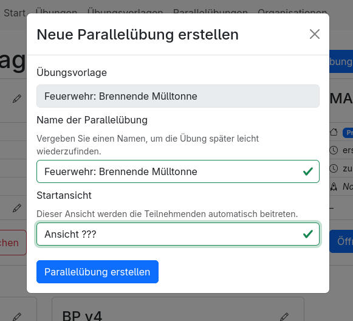
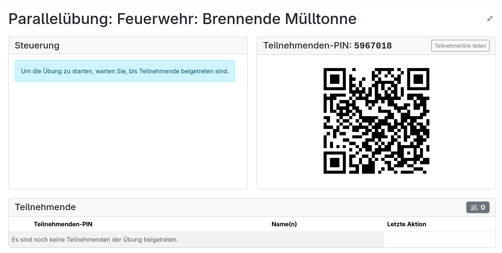
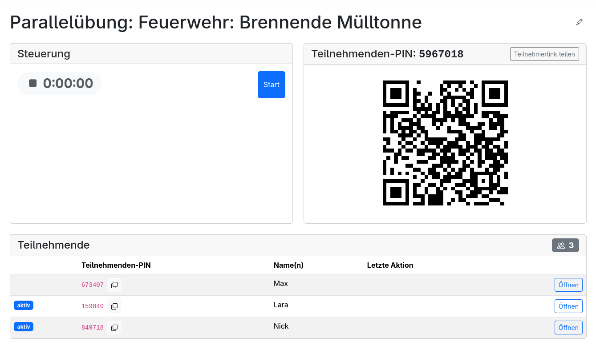
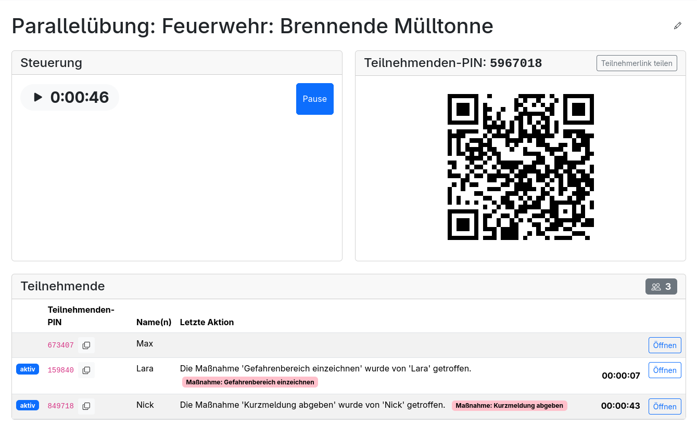
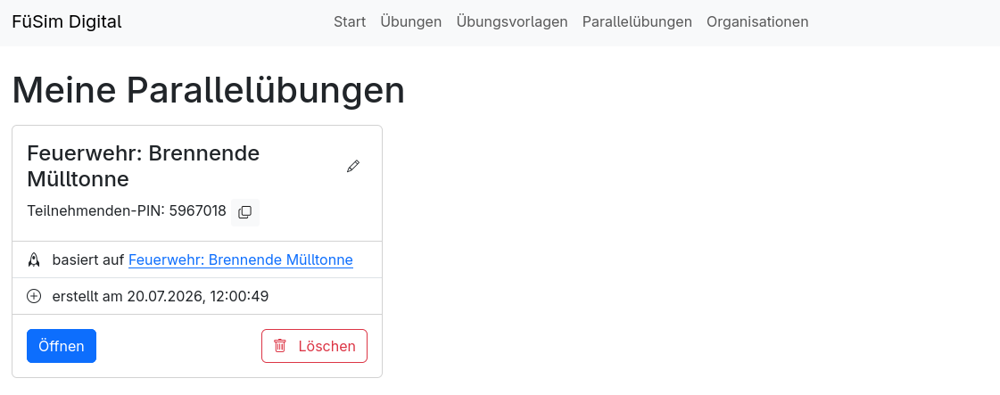

# Parallelübungen

Parallelübungen sind ein besonderes Übungsformat: Im Gegensatz zu normalen Mehrspieler-Übungen, wo alle Teilnehmenden in der gleichen Übung zusammenarbeiten, starten die Teilnehmenden bei Parallelübungen nur von der gleichen Übungsvorlage aus und treffen dann aber jeweils in ihren eigenen Übungsinstanzen Entscheidungen. Sie eignen sich z. B. um die korrekte Anwendung des Führungskreislaufs (FwDV 100) zu üben.

> [!NOTE]
> Für das Erstellen und Durchführen benötigen Übungsleitende ein [Benutzerkonto](../5_users/index.md).

## Parallelübungen vorbereiten

Um eine Parallelübung vorzubereiten, muss zunächst eine [Übungsvorlage erstellt](../4_editing/index.md#übungsvorlagen-verwalten) werden. In dieser kann das Szenario vorbereitet werden. Besonders hilfreich bei Parallelübungen sind Maßnahmen, um eigenständige Interaktionen der Teilnehmenden zu erlauben, und [Erkundungselemente](3_exercise_elements.md#erkundungselemente), um die Erkundung der Lage darzustellen. Wichtig ist aber, dass die Parallelübung eine [Ansicht](3_exercise_elements.md#ansichten) enthält, in der die Teilnehmenden später automatisch der Übung beitreten.

## Parallelübung durchführen

Die vorbereitete Übungsvorlage kann nun verwendet werden, um eine neue Parallelübung zu erstellen. Dafür muss in der Liste der Übungsvorlagen über den Button <kbd>Neue Übung</kbd> → <kbd>Parallelübung</kbd> ausgewählt und in dem sich öffnenden Dialog die Übung konfiguriert werden: Neben einem Namen muss dafür die Startansicht angeben werden, welcher die Teilnehmenden automatisch beitreten werden.

Nun öffnet sich automatisch die Parallelübungsübersicht. Im oberen Bereich befindet sich links die Steuerung und rechts ein QR-Code, mit dem die Teilnehmenden der Übung beitreten können. Zudem befindet sich über dem QR-Code auch ein Button <kbd>Teilnehmerlink teilen</kbd>, welcher ebenfalls das Beitreten ermöglicht. Im unteren Bereich sieht man eine Liste der Teilnehmenden in der Übung, zu Beginn ist diese leer:

Wenn Teilnehmende beitreten, enthält dabei neben der spezifischen Teilnehmenden-PIN für die jeweilige Übungsinstanz den Namen des Teilnehmenden und die Information, ob der Teilnehmende aktiv ist, also sich aktuell in der Übung befindet.

Nachdem alle Teilnehmenden mittels QR-Code oder Link beigetreten sind, kann die Übung gestartet werden. Dafür muss im Bereich <kbd>Steuerung</kbd> auf den Button <kbd>Start</kbd> geklickt werden. Damit startet die Zeit und alle Teilnehmenden können nun mit ihrer jeweiligen Übung interagieren.

> [!WARNING]
> Sollte während der Übung nun noch jemand beitreten, wird die Zeit für diese Person vorgespult und die Person landet danach direkt in der laufenden Übung, in der sich möglicherweise bereits der Zustand von Patienten verschlechtert hat oder sich technische Herausforderungen weiterentwickelt haben.

Besonders wichtige Aktionen der Teilnehmenden werden live in der Übersicht über die Teilnehmenden in der Spalte <kbd>Letzte Aktion</kbd> dargestellt.

Wenn die Übung beendet werden soll, muss auf den Button <kbd>Pause</kbd> geklickt werden. Die Zeit und die Übung ist damit für alle Teilnehmden pausiert und diese können in der Übung nichts mehr machen.

## Übersicht über Parallelübungen

Eine Liste der Parallelübungen kann unter dem Menüpunkt [<kbd>Parallelübungen</kbd>](https://fuesim.digital/exercises/parallel) gefunden werden. Dort kann über <kbd>Öffnen</kbd> die eben beschriebene Parallelübungsübersicht wieder geöffnet werden oder über <kbd>Löschen</kbd> die Übung gelöscht werden.

