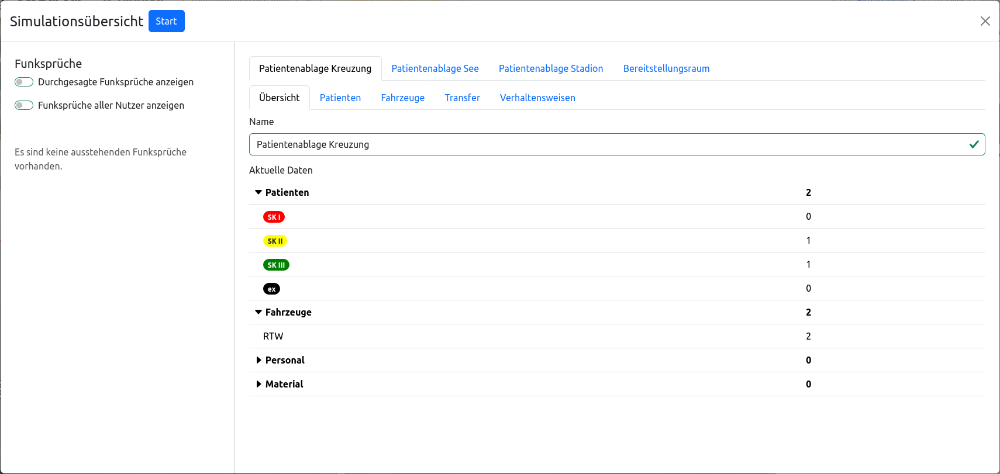
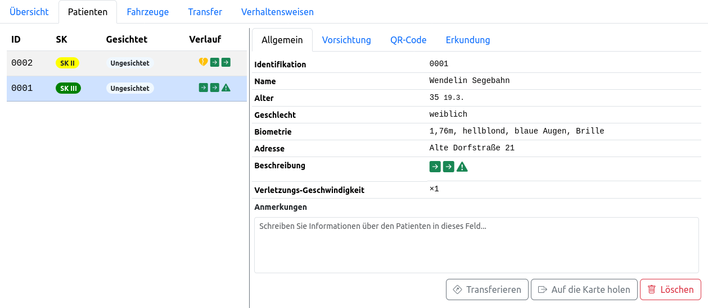
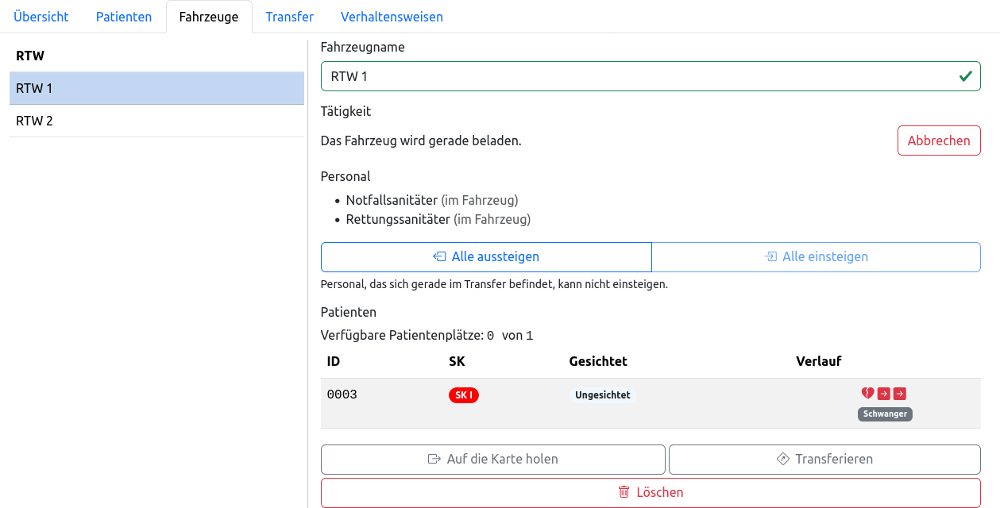
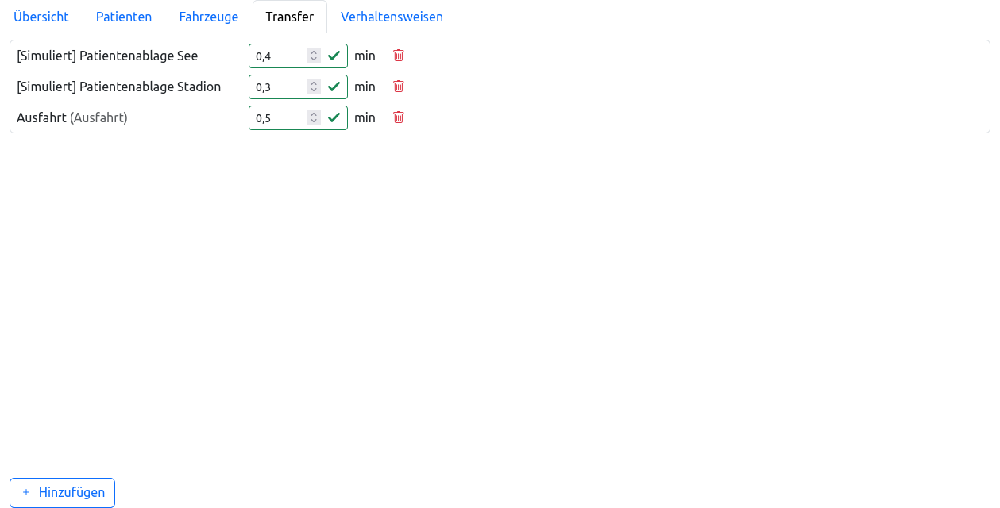
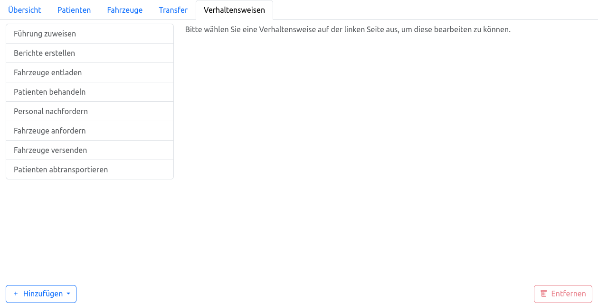

# Allgemeines

## Konzepte

Über die dynamische Simulation von Patienten und technischen Herausforderungen hinaus bietet FüSim Digital die Möglichkeit, das gesamte Geschehen in einem oder mehreren Bereichen auf der Karte zu simulieren. Für jeden _simulierten Bereich_ kann dabei festgelegt werden, wie sich die dortige, simulierte Führungskraft verhalten soll. Dadurch können zum Beispiel ganze Patientenablagen oder Bereitstellungsräume simuliert werden.

> [!WARNING]
> Die simulierten Bereiche unterstützen aktuell nur Behandlung und Transport von Patienten und die Organisation von Bereitstellungsräumen und sind auf MANV-Lagen zugeschnitten. Technische Herausforderungen können von simulierten Bereichen nicht bearbeitet werden.

Diese Funktion ermöglicht es, auch in kleinen Gruppen Einsatzleitungen auszubilden, die in einer sich dynamisch entwickelnden Lage agieren müssen, ohne dass weitere Teilnehmende oder Übungsleitende für die Rollen der untergeordneten Führungskräfte benötigt werden.

Der Parallelbetrieb von simulierten Bereichen und von Teilnehmenden besetzten Ansichten innerhalb einer Übung ist möglich. Allerdings können einzelne Elemente (Fahrzeuge, Personal, Patienten, …) zu einem bestimmten Zeitpunkt nur entweder von der Simulation oder von Teilnehmenden genutzt werden. Zur Verdeutlichung sind die simulierten Bereiche auf der Karte als ausgefüllte Flächen dargestellt, deren Inhalte nicht sichtbar sind. Eine explizite Übergabe von Fahrzeugen, Personal und Patienten zwischen Simulation und Teilnehmenden ist möglich.

Für eine möglichst natürliche Interaktion der Teilnehmenden mit einem simulierten Bereich können Informationen per Funkspruch ausgetauscht werden. Abhängig von seinen Verhaltensweisen erstellt ein simulierter Bereich selbst Funksprüche, außerdem können per Funk Befehle erteilt und Informationen abgefragt werden. FüSim Digital hat keine Anbindung an Funktechnik, stattdessen werden Funksprüche in Textform bereitgestellt. Für die Übungsdurchführung wird ein Teilnehmer oder Übungsleiter benötigt, der die Rolle des "Schnittstellenfunkers" übernimmt und die Funksprüche durchsagt oder Befehle entgegennimmt.

## Begriffe

### Simulierter Bereich

Die Simulation ist in simulierten Bereichen organisiert, die auf der Karte angeordnet werden. Jeder Bereich kann einzeln konfiguriert werden und dadurch individuelles Verhalten aufweisen.

Simulierte Bereiche können wie Ansichten auf der Karte platziert und Fahrzeuge, Personal und Patienten hinzugefügt werden. Ihre innere räumliche Anordnung bleibt jedoch verborgen. Informationen aus der Simulation können per Funkspruch abgefragt werden.

### Verhaltensweise

Verhaltensweisen bilden einzelne Funktionen der Simulation ab, zum Beispiel die Behandlung von Patienten oder das Bereitstellen von Fahrzeugen. Das Verhalten eines simulierten Bereichs ergibt sich aus der Kombination der für diesen Bereich gewählten Verhaltensweisen.

Die Verhaltensweisen sind so gestaltet, dass sie möglichst kleine, in sich geschlossene Aufgaben übernehmen, die für verschiedenste Arten simulierter Bereiche wiederverwendbar sind. So gibt es zum Beispiel eine eigene Verhaltensweise zum Erstellen von Berichten per Funk, die sowohl in Patientenablagen (Anzahl der Patienten, Fortschritt der Behandlung) als auch Bereitstellungsräumen (Anzahl der Fahrzeuge, Bedarf an weiteren Ressourcen) genutzt werden kann.

Alle verfügbaren Verhaltensweisen sind unter [Verhaltensweisen](2_behaviors.md) beschrieben.

### Funkspruch & Schnittstellenfunker

Funksprüche ermöglichen die Interaktion von Teilnehmenden mit der Simulation in beide Richtungen.

Möchte ein simulierter Bereich eine Information an die Einsatzleitung weitergeben, so erscheint die Meldung als Text auf dem [Bildschirm des Schnittstellenfunkers](3_ifs.md). Dieser kontaktiert nun über ein Medium der Wahl (je nach Größe der Übung zum Beispiel Funk oder Zuruf) die Einsatzleitung, wobei er sich selbst als Führungskraft des simulierten Bereichs ausgibt, und übermittelt die Nachricht.

Umgekehrt nimmt der Schnittstellenfunker alle Funksprüche, Zurufe und schriftliche Befehle entgegen, die an Personal aus einem simulierten Bereich gerichtet sind, und passt die Einstellungen der Simulation entsprechend an. Gängige Anfragen (zum Beispiel die Anzahl von Patienten oder Fahrzeugen) und Befehle (zum Beispiel, Fahrzeuge aus dem Bereitstellungsraum zu entsenden) kann der Schnittstellenfunker mit wenigen Klicks über eine spezielle Benutzeroberfläche bearbeiten. Für einen möglichst großen Handlungsspielraum der Einsatzleitung kann der Schnittstellenfunker auf die bekannte Übungsleiter-Benutzeroberfläche mit allen Einstellungsmöglichkeiten zurückgreifen.

Der Schnittstellenfunker muss sich selbst keine Informationen zum Übungsablauf merken oder mit der Karte interagieren, sodass eine Person als Schnittstellenfunker mehrere simulierte Bereiche bedienen kann. Für besonders große Übungen, oder wenn neben der Einsatzleitung noch weitere Teilnehmende mit simulierten Bereichen interagieren können sollen, kann es notwendig sein, die Rolle des Schnittstellenfunkers mit mehreren Personen zu besetzen, um Engpässe zu vermeiden.

## Aufbau des Simulierte-Bereich-Fensters

Bei Klick auf einen simulierten Bereich öffnet sich ein Popup, über welches dieser Bereich konfiguriert werden kann, analog zu anderen Übungselemente auf der Karte. Da die Einstellungsmöglichkeiten von simulierten Bereichen sehr komplex sind, empfiehlt es sich aber, in die großen Simulationseinstellungen zu wechseln. Diese ist über <kbd>**Durchführung > Simulationseinstellungen (Übungsleitung)**</kbd> erreichbar.

Auf der linken Seite der Simulationseinstellungen werden [Funksprüche](#funkspruch--schnittstellenfunker) angezeigt, sodass diese Ansicht theoretisch auch von Schnittstellenfunkern genutzt werden kann. Für diese gibt es aber auch [eine eigene Ansicht](3_ifs.md).

Auf der rechten Seite können alle simulierten Bereiche der Übung verwaltet werden. Jeder simulierte Bereich besitzt einen eigenen Reiter, im oben gezeigten Beispiel gibt es also vier Bereiche, drei Patientenablagen "Kreuzung", "See" und "Stadion", sowie einen Bereitstellungsraum. Darunter gibt es eine zweite Reihe von Reitern, mit denen zwischen verschiedenen Optionen des ausgewählten simulierten Bereichs gewechselt werden kann.

### Übersicht

In der Übersicht kann der Name des simulierten Bereichs festgelegt werden. Zudem zeigt eine Liste die Anzahl an Patienten, Fahrzeugen, Personal und Material im Bereich an.

### Patienten

Im Reiter Patienten können die Details zu allen Patienten eingesehen werden. Auf der linken Seite gibt es eine Übersicht aller Patienten, auf der rechten Seite werden die Details des ausgewählten Patienten angezeigt.

Diese Patienten-Details sind größtenteils identisch zum [Patienten-Popup auf der Karte](../2_exercises/3_exercise_elements.html#patienten), allerdings gibt es zusätzlich noch die Möglichkeiten, den Patienten zu transferieren (abzutransportieren), auf die Karte zu holen oder zu löschen.

### Fahrzeuge

Dieser Reiter ist vergleichbar zum Reiter Patienten aufgebaut. Es gibt eine Liste aller Fahrzeuge sowie eine Detail-Ansicht.

Die Detailansicht zeigt neben den bekannten Einstellungsmöglichkeiten aus dem [Fahrzeug-Popup](../2_exercises/3_exercise_elements.md#fahrzeuge-mit-personal-und-material) die aktuelle Tätigkeit (Nutzung) des Fahrzeugs an. Im oben gezeigten Beispiel wird das Fahrzeug gerade für einen Transfer beladen. Außerdem gibt es eine Liste der im Fahrzeug befindlichen Patienten und wie zuvor die Möglichkeiten zum Transfer, auf die Karte schieben und löschen des Fahrzeugs.

### Transfer

Über diesen Reiter können Transferverbindungen zu anderen simulierten Bereichen oder Transferpunkten angelegt werden. Die Bedienung ist identisch zum [Transferpunkt-Popup](../2_exercises/3_exercise_elements.md#transferpunkte).

### Verhaltensweisen

Über diesen Reiter können die Verhaltensweisen des simulierten Bereichs konfiguriert werden. Die linke Seite zeigt alle Verhaltensweisen, die dem simulierten Bereich hinzugefügt wurden. Wird eine Verhaltensweise ausgewählt, kann sie auf der rechten Seite konfiguriert werden. Die einzelnen Optionen der Verhaltensweisen sind unter [Verhaltensweisen](2_behaviors.md) beschrieben.

Zudem können über die Buttons <kbd>**Hinzufügen**</kbd> und <kbd>**Entfernen**</kbd> am unteren Rand weitere Verhaltensweisen hinzugefügt oder die aktuell ausgewählte Verhaltensweise gelöscht werden.

## Vordefinierte Bereichstypen

Zum einfachen Erstellen von Übungen gibt es Vorlagen von simulierten Bereichen, die für gängige Aufgaben in MANV-Lagen vorkonfiguriert sind. Diese Vorlagen können beliebig angepasst werden, um den gewünschten Übungsablauf zu erzeugen. Allerdings sind die Vorlagen so gestaltet, dass eine Übung ohne weitere Einstellungen sofort gestartet werden kann und es zu einer sinnvollen Interaktion der Verhaltensweisen kommt.

Alle Einstellungen dieser Vorlagen können auch manuell auf einem normalen simulierten Bereich vorgenommen werden – es gibt keine Funktionen, die ausschließlich über die Vorlagen genutzt werden können.

Im Folgenden sind alle Vorlagen kurz beschrieben. Das genaue Verhalten der Vorlagen und alle Einstellungsmöglichkeiten ergeben sich aus der [Dokumentation der einzelnen Verhaltensweisen](2_behaviors.md). Für jede Vorlage ist angegeben, mit welchen Verhaltensweisen diese konfiguriert ist; zudem sind alle Verhaltensweisen im Fenster des simulierten Bereichs aufgelistet.

### Patientenablage

Eine simulierte Patientenablage kümmert sich um die Zählung, Sichtung und Behandlung von Patienten. Dazu werden automatisch weitere Fahrzeuge angefordert, falls das bereits vor Ort verfügbare Personal nicht zur Behandlung ausreicht.

Bei wesentlichen Fortschritten – zum Beispiel, wenn alle Patienten gezählt oder vorgesichtet wurden – informiert die Patientenablage die Einsatzleitung automatisch per Funkspruch. Diese Informationen können auch jederzeit angefragt werden.

In Zusammenspiel mit einem simulierten Bereitstellungsraum können Fahrzeuge automatisch abgerufen werden. Ebenso können in Zusammenspiel mit einer simulierten Transportorganisation Patienten automatisch in Krankenhäuser transportiert werden. Beide Funktionen können alternativ auch manuell von Teilnehmenden ausgelöst werden.

Die Patientenablage nutzt die folgenden Verhaltensweisen:

- [Führung zuweisen](2_behaviors.md#führung-zuweisen)
- [Berichte erstellen](2_behaviors.md#berichte-erstellen)
- [Fahrzeuge entladen](2_behaviors.md#fahrzeuge-entladen)
- [Patienten behandeln](2_behaviors.md#patienten-behandeln)
- [Personal nachfordern](2_behaviors.md#personal-nachfordern)
- [Fahrzeuge anfordern](2_behaviors.md#fahrzeuge-anfordern)
- [Fahrzeuge versenden](2_behaviors.md#fahrzeuge-versenden)
- [Patienten abtransportieren](2_behaviors.md#patienten-abtransportieren)

### Bereitstellungsraum

Ein simulierter Bereitstellungsraum puffert Fahrzeuge, die an der Einsatzstelle ankommen. Nach Wahl kann der Bereitstellungsraum die Fahrzeuge wie folgt den anderen Bereichen zuteilen:

- Automatische, gleichmäßige Verteilung, um eine Grundversorgung in allen Bereichen sicherzustellen. Siehe [Fahrzeuge verteilen](2_behaviors.md#fahrzeuge-verteilen)
- Als Reaktion auf Anfragen von Bereichen, die konfiguriert sind, Fahrzuge bei diesem Bereitstellungsraum anzufordern. Siehe [Fahrzeuganfragen beantworten](2_behaviors.md#fahrzeuganfragen-beantworten)
- Manuell auf Anforderung der Teilnehmenden

Der Bereitstellungsraum nutzt die folgenden Verhaltensweisen:

- [Führung zuweisen](2_behaviors.md#führung-zuweisen)
- [Berichte erstellen](2_behaviors.md#berichte-erstellen)
- [Fahrzeuge versenden](2_behaviors.md#fahrzeuge-versenden)
- [Fahrzeuganfragen beantworten](2_behaviors.md#fahrzeuganfragen-beantworten)
- [Fahrzeuge verteilen](2_behaviors.md#fahrzeuge-verteilen)

### Transportorganisation

Eine simulierte Transportorganisation verwaltet den Abtransport von Patienten in Krankenhäuser über mehrere Patientenablagen hinweg. Dazu werden Fahrzeuge abgerufen, die zu den Patientenablagen geschickt werden, sofern es dort noch Patienten zum Transport gibt.

Die Transportorganisation nutzt die folgenden Verhaltensweisen:

- [Führung zuweisen](2_behaviors.md#führung-zuweisen)
- [Berichte erstellen](2_behaviors.md#berichte-erstellen)
- [Transportorganisation](2_behaviors.md#transportorganisation)

### Einsatzabschnitt

Diese Vorlage dient zur Erstellung eigener simulierter Bereiche. Ohne weitere Konfiguration wird ein simulierter Einsatzabschnitt kein beobachtbares Verhalten zeigen.

Ein simulierter Einsatzabschnitt ist bereits mit folgenden zwei Verhaltensweisen vorkonfiguriert, da diese für alle anderen Verhaltensweisen benötigt werden:

- [Führung zuweisen](2_behaviors.md#führung-zuweisen)
- [Berichte erstellen](2_behaviors.md#berichte-erstellen)
