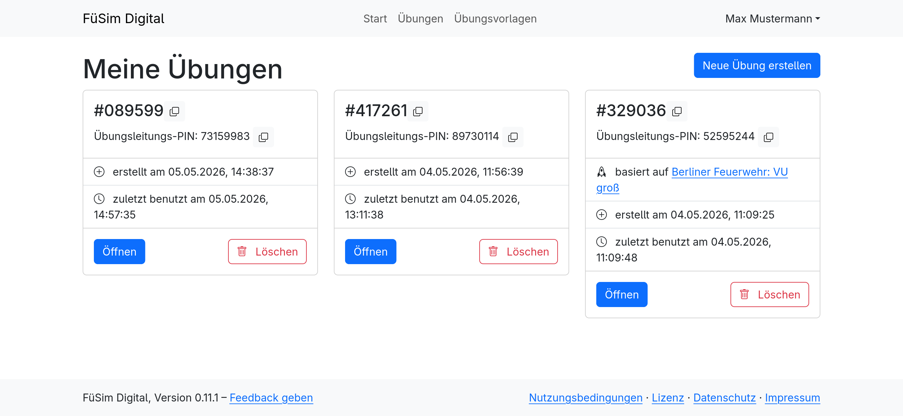
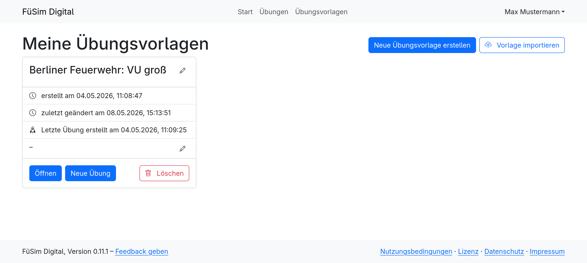

# Übungselemente und Vorlagen

## Übungen verwalten

Wenn man mit einem [Benutzerkonto](../5_users/) angemeldet ist, werden sowohl über die Startseite als auch über die [Übungsliste](https://fuesim.digital/exercises) neu erstellte Übungen automatisch mit dem Benutzerkonto verknüpft und dort gespeichert. Sie sind dann über die eben erwähnte Übungsliste jederzeit wieder abrufbar.

Für jede Übung werden neben der [Teilnehmenden-PIN](../2_exercises/1_general.md#teilnehmenden-pin) (große, 6-stellige Zahl) und der Übungsleitenden-PIN (kleine, 8-stellige Zahl) das jeweilige Erstellungsdatum sowie das Datum der letzten Benutzung (also der Zeitpunkt, zudem die Übung das letzte geöffnet wurde) angezeigt. Weiterhin ist es hier auch möglich, die Übung im Übungseditor zu öffnen oder sie zu löschen.

## Übungsvorlagen verwalten

Um Übungen für wiederkehrende Verwendungen zu erstellen, bietet es sich an, eine Übungsvorlage einzusetzen. Übungsvorlagen sehen im Übungseditor genauso wie Übungen aus, können jedoch nicht gestartet werden. Darauf weist im Editor für Übungsvorlagen auch ein Warnhinweis hin.

Die Liste der Übungsvorlagen kann unter dem Menüpunkt [<kbd>Übungsvorlagen</kbd>](https://fuesim.digital/exercises/templates) gefunden werden und ist zunächst leer. Neue Vorlagen können hier entweder direkt erstellt werden oder durch das Hochladen von alten [Übungsexports](../2_exercises/1_general.md#übungen-exportieren) erzeugt werden. Zum leichteren Wiederfinden kann ein Name und eine Beschreibung vergeben werden. In der Liste tauchen die Vorlagen dann mit Namen, Beschreibung, dem Erstellungsdatum, dem Datum der letzten Änderung und dem Zeitpunkt, zu dem die letzte Übung erstellt wurde, auf.

Über <kbd>Öffnen</kbd> kann die Vorlage im Übungseditor geöffnet werden und das Szenario wie im Abschnitt [Übungen](../2_exercises/index.md) beschrieben erstellt werden.

Über <kbd>Neue Übung</kbd> kann dann die Vorlage genutzt werden, um aus ihr eine Übungsinstanz zu erstellen, die dann mit Teilnehmenden bespielt werden kann. Weiterhin ist hier auch das Löschen von Übungsvorlagen möglich.
