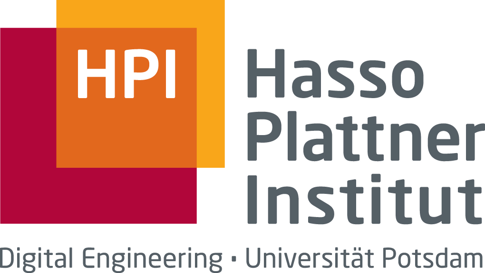
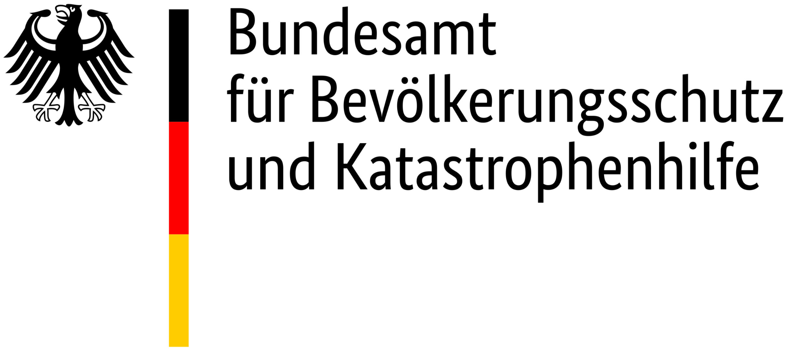
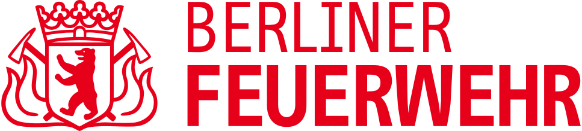
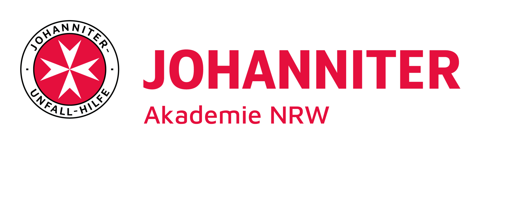
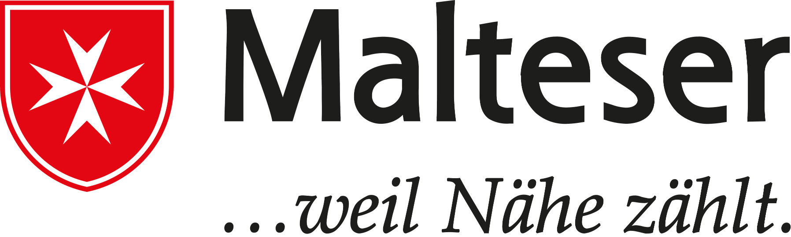

# Über dieses Projekt

Diese Webanwendung entstand im Rahmen mehrerer Bachelorprojekte am [Hasso-Plattner-Institut Potsdam](https://hpi.de) in den Jahren 2021, 2022, 2023, 2025 und 2026. Sie basiert auf der Führungssimulation MANV (FüSim MANV), einer von der [Bundesakademie für Bevölkerungsschutz und Zivile Verteidigung](https://www.bbk.bund.de/DE/Themen/Akademie-BABZ/akademie-babz_node.html) am [Bundesamt für Bevölkerungsschutz und Katastrophenhilfe](https://www.bbk.bund.de/) entwickelten Simulation für medizinische Führungskräfte für den Fall eines Massenanfalls von Verletzten (MANV). Sie ermöglicht zunehmend auch das Üben anderer Großschadenslagen.

Der Quelltext dieser Webseite und die dahinterstehenden Technologien stehen als Open-Source-Software auf [GitHub](https://github.com/hpi-sam/fuesim-digital) zur Verfügung. Weitere Informationen über dieses und weitere Projekte finden Sie auf der [Projektwebseite](https://manv-simulation.de).

## Projektpartner

## Projektbeteiligte

**Projektteam 2025/26:** [Felix Koch](https://github.com/fekoch), [Johannes Potzi](https://github.com/JohannesPotzi), [Robert Stündl](https://github.com/Quixelation) und [Jonathan Weth](https://github.com/hansegucker)  
**Projektteam 2022/23:** [Lukas Hagen](https://github.com/Greenscreen23), [Nils Hanff](https://github.com/Nils1729), [Benildur Nickel](https://github.com/benn02) und [Lukas Radermacher](https://github.com/lukasrad02)  
**Projektteam 2021/22:** [Julian Schmidt](https://github.com/Dassderdie), [Clemens Schielicke](https://github.com/ClFeSc), Florian Krummrey und Marvin Müller-Mettnau  
**Betreuende:** [Matthias Barkowsky](https://hpi.de/giese/people/matthias-barkowsky.html) und [Christian Schäffer](https://hpi.de/giese/people/christian-schaeffer.html)
